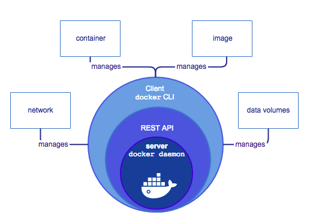

# Docker  - Get Start

## Docker 概念

docker 是一个让开发人员和运维人员通过容器进行构建,允许,和共享应用的平台. 通过使用容器进行应用部署叫做`容器化`. 容器并不是新的技术, 但是将他们应用于易于部署应用确实一个创新.

容器化日益流行的原因:

- 灵活: 大多数应用甚至复杂应用也可以使用容器化
- 轻量级: 容器利用并共享主机内核, 在系统资源方面比虚拟机更加有效.
- 可移植: 可以在本地进行构建, 然后在云端或其他地方部署
- 低耦合: 容器具有高度封装,可以在不影响其他容器的情况下升级容器
- 可扩展: 可以在整个数据中心内增加并自动分发容器副本。
- 安全:容器将激进的约束和隔离应用于进程，而无需用户方面的任何配置

### 镜像&容器

本质上, 容器只是一个运行中的进程, 这个进程增加了封装的特性, 这个特性是为了让容器于主机和其他容器保持隔离.  容器之间的隔离有一个很重要的概念就是每一个容器之间都有自己私有的文件系统,  这个文件系统由dcoker的镜像提供.  一个镜像包含了应用运行时所有需要的资源: 代码或二进制文件, 运行时环境,依赖以及任何其他必须的文件系统对象.

### 容器 & 虚拟机

容器在本地允许并与其他容器共享主机内核.  它运行一个离散进程, 与其他可以执行文件比占用更少的内存, 这使得它是轻量级的.

## Docker overview

docker 是一个开发的平台用于开发,交付和运行应用, 它允许你将基础架构和你的应用隔离,从而可以快速交付应用. 使用docker可以让你以管理应用相同的方式来管理基础架构.

通过利用Docker快速交付,测试和部署代码的方法, 你可以大大减少软件开发和在生产环境运行代码之间的延迟.

## Docker 平台

docker 支持打包应用并在一个松散的隔离的容器中运行应用的能力,  隔离和安全性可以使得可以在给定的主机上同时运行多个容器. 容器是轻量级的因为他们不需要加载额外的管理程序,而是直接运行在主机的内核中.  这意味着与使用虚拟机比, 在给定的硬件组合上可以运行更多的容器. 甚至你可以在虚拟机上运行docker.

docker提供了工具和平台来管理容器的生命周期:

- 使用容器开发你的应用及其支持组件
- 容器成为分发和测试应用的单元
- 准备就绪后, 可以将应用程序作为容器或协调服务部署到生产环境中, 无论你的生产环境是本地数据中心,云提供商还是二者的混合体, 其工作原理都相同.

## Docker 引擎

Docker Engine是具有以下主要组件的客户端-服务器应用程序:

- 服务器是一种长期运行的叫做守护程序的进程
- REST API是一个特殊接口,可以调用守护进程并发送执行指令
- 命令行接口客户端

