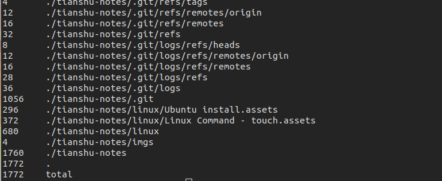
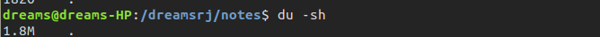
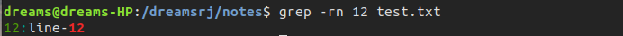

# touch ：创建文件/修改访问时间

该命令用于修改文件的访问时间和最后修改时间。

如果该文件不存在，那么将会创建一个空文件，此时该文件大小为0。 如果指定 `-c` 或 `-h`参数则不会创建空文件。

- 创建空文件

```shell
touch test.sh
ls -l
```


- 修改文件访问时间和最后修改时间


文件的访问时间和修改时间均被


# file ：查看文件

file 命令可以查看文件类型和文件编码

- 查看文件


- 查看目录


- 查看链接文件

  

# cat ：查看文件内容

cat 命令用于将文件连接到标准输出上，即输出文件内容到界面。


`-n`参数用于显示行号

`-b`参数用于只在有内容的行显示行号


# more ：分页显示文件内容

more 可以在浏览大文件时控制文件内容的显示。 我们可以使用空格或回车控制是否浏览下一页。

浏览完之后，使用`q`键退出 more。


# less ：more的升级版


# tail ：查看文件末尾内容

查看文件的末尾几行内容。常用于监控日志文件。

使用`-n`参数查看文件末尾3行内容。


使用`-f`参数动态监控文件内容。


# head：查看文件开头的内容

head 命令查看文件开头的几行内容，默认查看10行内容。

```shell
tail -20 test.txt
```


# ps 监测进程

`ps`命令用于监测运行中的进程。默认情况下，ps命令只显示运行在**当前控制台**下属于***当前用户***的进程。


# du：显示某个特定目录的磁盘使用情况

du 命令用于显示指定目录的磁盘使用情况，默认du显示当前目录下的每个目录和文件的磁盘使用情况。

显示的顺序从目录层级的最低层开始，然后按照文件，子目录，目录逐级向上。

如果du命令加参数，实际使用作用并不大。


## 实用参数

- `-c`

该参数用于显示所列出文件的总大小，在最底部输出。

```shell
du -c
```




- `-s`

  显示每个输出参数的总计

  

# 搜索文件内容

```shell
gerp [options] pattern [file]
```


```shell
grep -rn 12 test.txt
```




- `-r` :
- `-n` ：显示匹配数据所在行数
- `-v`：反向匹配（显示没有匹配到的内容）
- `-c`：显示有多上行匹配到数据
- `-e`：制定多个匹配模式，`grep -e abc -e bbc filename`
- 