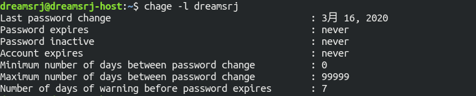

# 桌面创建快捷方式

```shell
ln -s filepath 快捷方式路径
```


`ln -s /dreamsrj/spring/ ~/Desktop/spring`


# 设置用户密码过期时间

### 相关命令

- chage
- usermod

### 查看用户密码过期信息

```shell
chage -l username
```



### 修改用户密码过期时间

```shell
chage -M days username
```

如果days 为 99999 ，表示永不过期

###  关闭某个用户密码的ageing/expiring功能

关闭某个用户密码的ageing/expiring功能，可以将该用户的chage信息设置为如下内容：

set Minimum Password Age to 0
setMaximum Password Age to 99999
set Password Inactive to -1
setAccount Expiration Date to -1

使用命令行来设置就是：chage-I -1 -m 0 -M 99999 -E -1 username

### 统一设置所有用户的密码过期时间

统一设置所有用户的密码过期时间，可以修改/etc/login.defs里面的PASS_MAX_DAYS

