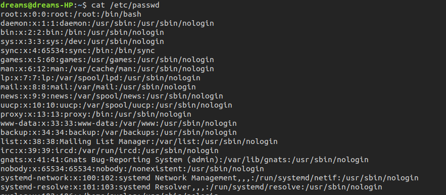
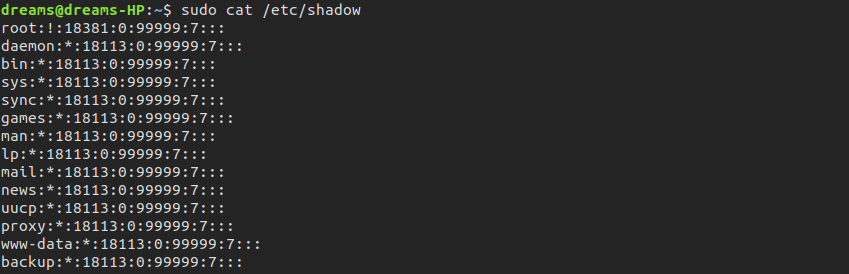
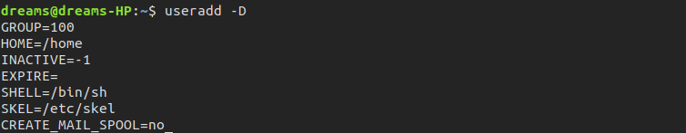

# Linux 权限

# /etc/passwd




```txt
root:x:0:0:root:/root:/bin/bash
```

登录用户名:用户密码:UID:GID:备注:HOME_PATH:默认shell

passwd文件中记录的密码都是x， 这并不是表示用户的密码都一样，而是处于安全原因讲加密后的密码隐藏，防止密码被破解。


# /etc/shadow

用户加密后的文件存储在 /etc/shadow 文件中，该文件只有root和特定程序（如：登录）才可以访问。




# 添加用户

useradd 命令用于向Linux系统中添加用户，以及设置用户的home目录。

添加用户的默认值：

```shell
useradd -D
```




