# Mybatis


## 缓存

缓存是一般的ORM 框架都会提供的功能，目的就是提升查询的效率和减少数据库的压力。跟Hibernate 一样，MyBatis 也有一级缓存和二级缓存，并且预留了集成第三方缓存的接口。

### Session Cache(一级缓存、查询缓存)

一级缓存也就是本地缓存。 该缓存基于当前的session对象， 也就是说该缓存存在session中， 如果session关闭，那么其中缓存的数据将会被清除。


```java
@Test
    public void testSessionCache() {
        String resource = "mybatis-config.xml";
        try {
            //读取配置文件，创建SessionFactory
            InputStream resourceAsStream = Resources.getResourceAsStream(resource);
            SqlSessionFactory ssf = new SqlSessionFactoryBuilder().build(resourceAsStream);

            //获取一个链接（数据库会话）
            SqlSession session = ssf.openSession();
            //获取mapper
            UserMapper mapper = session.getMapper(UserMapper.class);

            User user = mapper.selectOne(1L); //第一次查询
            System.out.println(user);

            User user2 = mapper.selectOne(1L); //第二次查询
            System.out.println(user);

            System.out.println(user == user2); //true, 返回的同一个对象

            SqlSession session2 = ssf.openSession();//重新获取链接
            UserMapper mapper1 = session2.getMapper(UserMapper.class);

            User user3 = mapper1.selectOne(1L);
            System.out.println(user == user3); //false, 返回的同一个对象


            session.close();
            session2.close();
        } catch (IOException e) {
            e.printStackTrace();
        }
```


如上代码：

第一次查询和第二次查询都是在同一个session中，且查询的是同一数据，所以第二次查询时，不会查询数据库而是从缓存中获取。从`System.out.println(user == user2);`返回true可以看出是同一个对象，说明么第二次查询并没有执行sql是从缓存中获取数据。

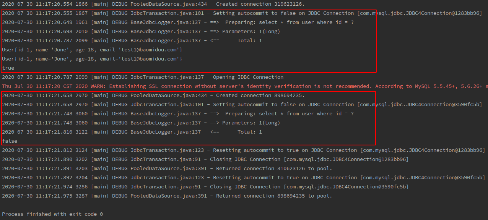

从日志中也可以看出，第二次查询并没有执行sql。 而第三次查询使用的是一个新的session，即使是查询到同一条数据，也执行了sql。

说明一级缓存是基于session的。


那么再看源码， `SqlSession session = ssf.openSession();`这里获取的session是`DefaultSqlSession`的实例对象. DefaultSqlSession中有一个exector属性

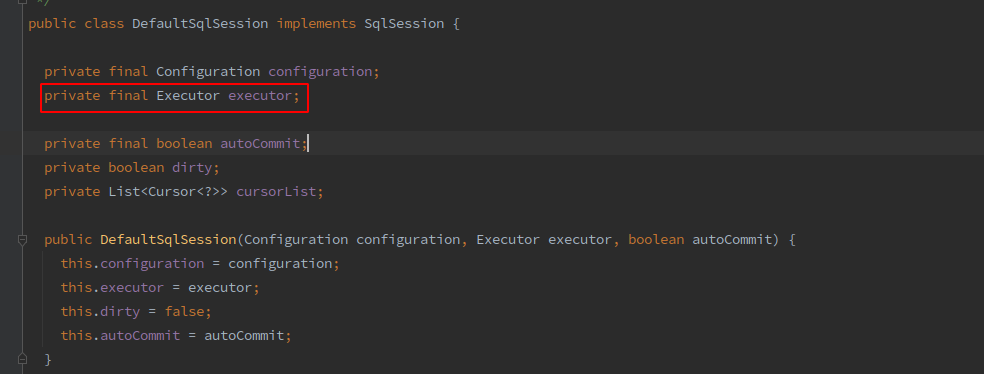

executor属性是在调用`ssf.openSession()`时创建的，其类型是SIMPLE， 所以创建的是`SimpleExecutor`实例。 

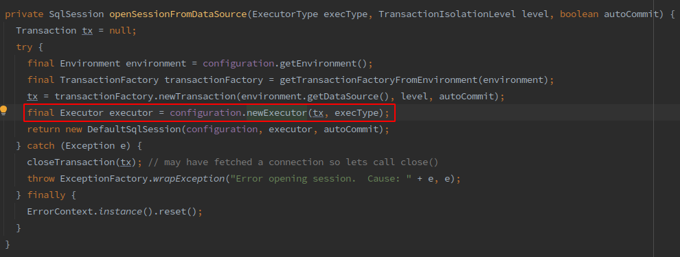

值得注意的是因为mybatis默认开启一级缓存，所以在创建executor时会使用`CachingExecutor`包装`SimpleExecutor`.

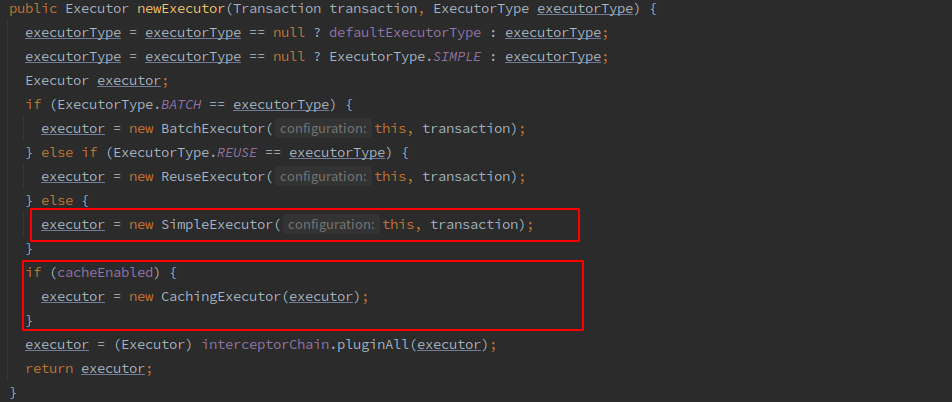

根据名字可以看出`CachingExecutor`是有缓存的，那么它如何使用缓存呢？

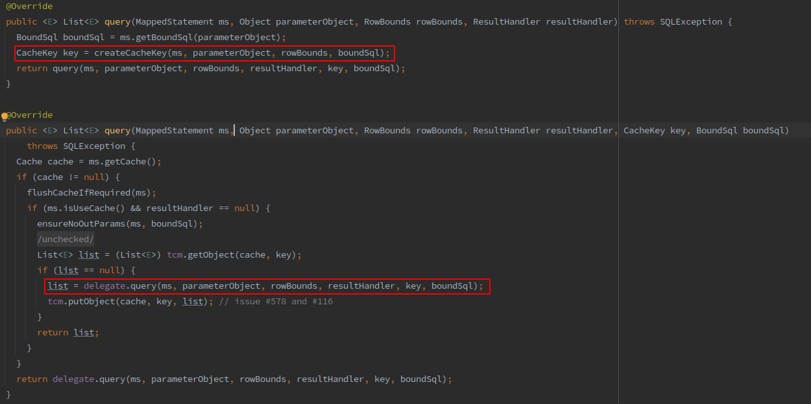

可以看到`CachingExecutor`查询时，会根据查询参数、查询语句等构建一个缓存的key。 ==注意这里`ms.getCache()`不是一级缓存==。

然后如果存在缓存，那么就返回缓存的对象，如果缓存中没有数据，那么就查询数据，然后根据构建的key将查询到数据缓存起来。 这里`CachingExecutor`并没有实际创建缓存，缓存的创建是在调用`delegate.query()`时创建。这里的delegate就是`SimpleExecutor`实例， 在创建Sqlsession时创建的。

现在我们来看看真正操作一级缓存的地方`BaseExecutor`

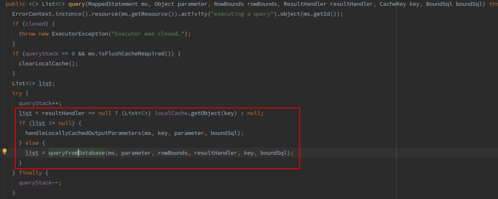

先看看`localCache`的声明，

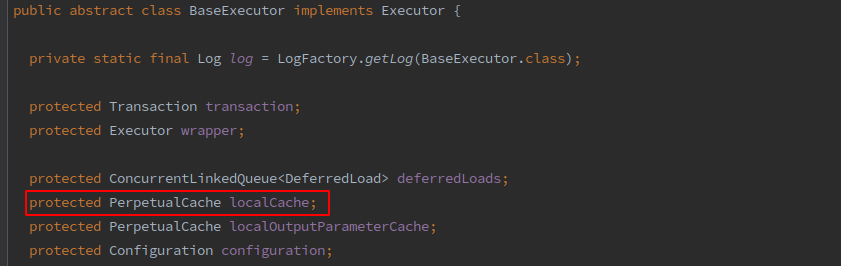

`PerpetualCache` 中定义了一个Map， 用来存储缓存的数据：

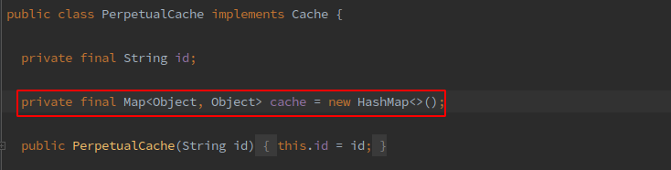

再回到BaseCache 中， 如果从`localCache`中存在key的缓存，那么就返回缓存中的数据，否则调用`queryFromDatabase()`从数据库中查询数据。而在`queryFromDatabase`方法中负责写入缓存，如下：

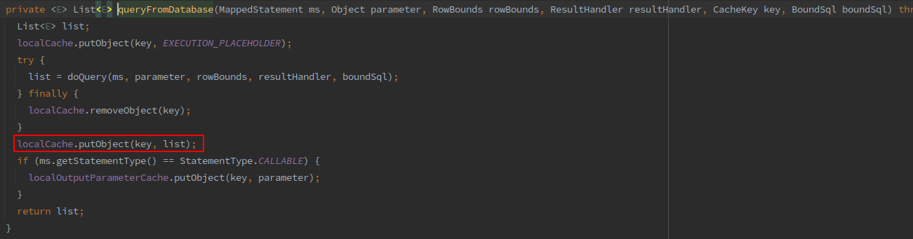


至此， 所有的一级缓存都是基于session级别的， 所以当session 调用`close()`方法后， 所有的缓存数据都会被清除。

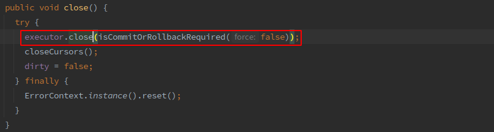

BaseExecutor close代码如下：

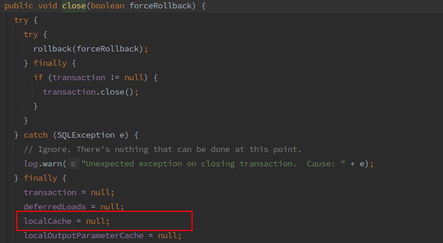

#### 其他操作对缓存的影响

对同一个session中进行update操作， 会直接清空缓存。

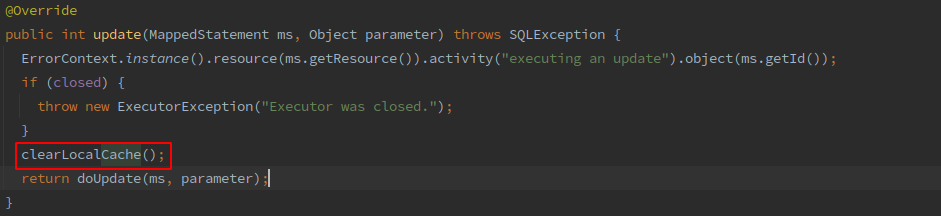

如果其他会话中对数据进行了更新操作， 会导致当前缓存数据为脏数据


```java
@Test
    public void testUpdateCache() {
        String resource = "mybatis-config.xml";
        try {
            //读取配置文件，创建SessionFactory
            InputStream resourceAsStream = Resources.getResourceAsStream(resource);
            SqlSessionFactory ssf = new SqlSessionFactoryBuilder().build(resourceAsStream);

            //获取一个链接（数据库会话）
            SqlSession session = ssf.openSession();
            //获取mapper
            UserMapper mapper = session.getMapper(UserMapper.class);

            User user = mapper.selectOne(1L); //第一次查询
            System.out.println(user);

            //执行更新操作
            user.setName("NewName");
            int i = mapper.updateUserName(user);
            System.out.println("update record num : " + i);

            User user2 = mapper.selectOne(1L); //第二次查询
            System.out.println(user);

            System.out.println("user equal : " + (user == user2));
            session.close();
        } catch (IOException e) {
            e.printStackTrace();
        }
    }
```

上面的代码在第一次和第二次查询中间执行了更新操作， 通过日志可以看出对同一个sql语句执行了两次查询，所以在updae之后清除了缓存，且是清除所有的缓存。

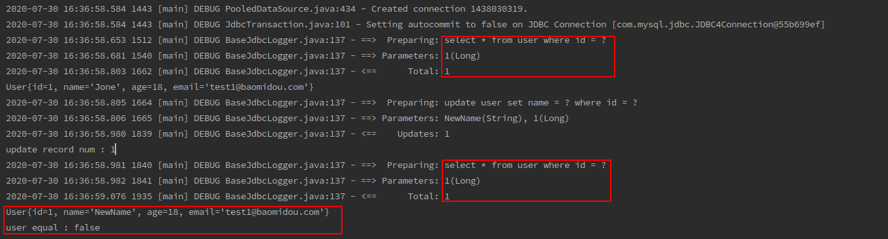

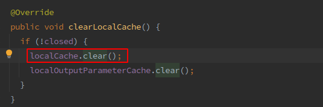

#### 一级缓存的不足

因为一级缓存不能跨session进行共享，所以在容易在不同的session缓存数据不一致。导致脏数据。 


#### 一级缓存的配置（SESSION、STATEMENT的区别）

```xml
<settings>
    <setting name="localCacheScope" value="SESSION"/>
    <!--        <setting name="localCacheScope" value="STATEMENT"/>-->
</settings>
```

一级缓存，默认开启且为缓存范围为SESSION级别，该级别的一级缓存在多会话且有写数据时存在脏数据的可能。还有一种是STATEMENT的一级缓存， 如果一级缓存设置为STATEMENT， 那么mybatis会将一级缓存中的数据清除。

```java
@Test
    public void testStatementCache() {
        String resource = "mybatis-config.xml";
        try {
            //读取配置文件，创建SessionFactory
            InputStream resourceAsStream = Resources.getResourceAsStream(resource);
            SqlSessionFactory ssf = new SqlSessionFactoryBuilder().build(resourceAsStream);
            //设置缓存范围为 STATEMENT
            ssf.getConfiguration().setLocalCacheScope(LocalCacheScope.STATEMENT);

            //获取一个链接（数据库会话）
            SqlSession session = ssf.openSession();
            //获取mapper
            UserMapper mapper = session.getMapper(UserMapper.class);

            User user = mapper.selectOne(1L); //第一次查询
            System.out.println(user);

            User user2 = mapper.selectOne(1L); //第二次查询
            System.out.println(user);

            System.out.println("user equal : " + (user == user2));
            session.close();
        } catch (IOException e) {
            e.printStackTrace();
        }
    }
```

输出的日志如下， 从日志中可以看出，虽然使用了一级缓存， 但是仍然查询了两次数据库，这说明 STATEMENT 范围的缓存并不会缓存上一次查询的数据：

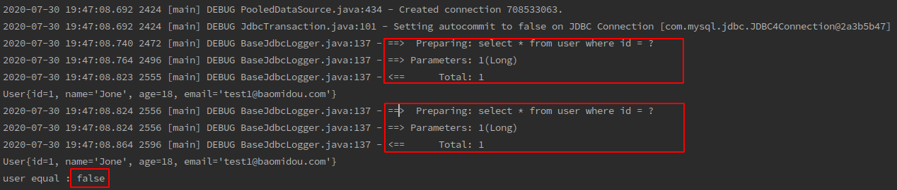

从源码上也可以看出来，如果缓存范围是`STATEMENT`那么将会清除缓存中的内容：

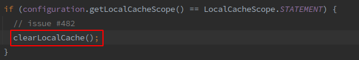


### 总结

1. MyBatis一级缓存的生命周期和SqlSession一致。
2. MyBatis一级缓存内部设计简单，只是一个没有容量限定的HashMap，在缓存的功能性上有所欠缺。
3. MyBatis的一级缓存最大范围是SqlSession内部，有多个SqlSession或者分布式的环境下，数据库写操作会引起脏数据，建议设定缓存级别为Statement。


### Statement Cache（二级缓存）

二级缓存可以解决一级缓存中无法跨session共享的问题，开启二级缓存后，会使用`CachingExecutor`装饰`Executor`进入一级缓存流程前先查询二级缓存中的数据。

起流程如下：

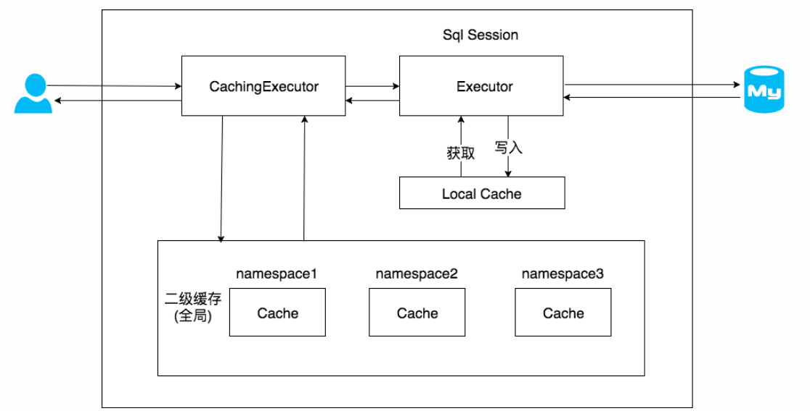

### 二级缓存配置

开启二级缓存，在mybatis的配置配置文件中配置cacheEnabled 为 true即为开启二级缓存。

```xml
<settings>
    <setting name="localCacheScope" value="STATEMENT"/>
    <setting name="cacheEnabled" value="true"/> 
</settings>
```

从源码中可以看出，二级缓存也是默认开启的。

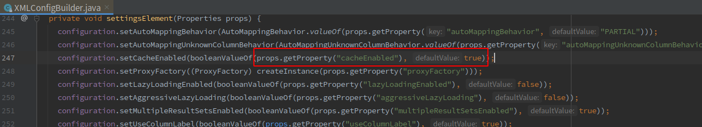


要启用二级缓存需要在mapper中也开启缓存， 否则不生效

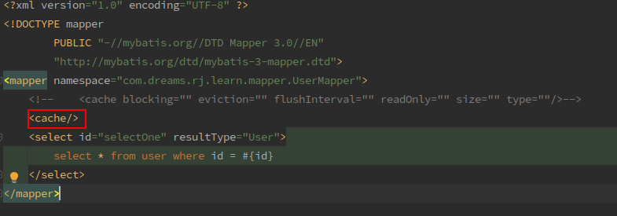

如果只配置`<cache/>`, 其效果如下：

- 映射文件中所有的select的结果都会被缓存
- 映射文件中所有的insert，delete， update 都会刷新缓存， **清除所有缓存数据**
- 缓存使用最近最少使用算法清除不需要的缓存（LRU， Least Recently Used）
- 缓存不会定时刷新
- 缓存会保存列表或对象的1024个引用
- 缓存被视为读/写缓存， 意味着获取到的对象并不是共享的，可以安全地被调用者修改，而不干扰其他调用者或线程所做的潜在修改。

> 缓存只作用于cache标签所在的映射文件的语句中。如果混合使用java api和xml映射文件，在公共接口中的语句将不会默认被缓存。需要使用@CacheNamespaceRef 注解指定缓存作用域

上面这段话的意思是不会缓存mapper接口中的使用注解指定的sql所查询出的数据。 需要使用 `@CacheNamespaceRef `指定缓存作用域才会缓存。


# End

