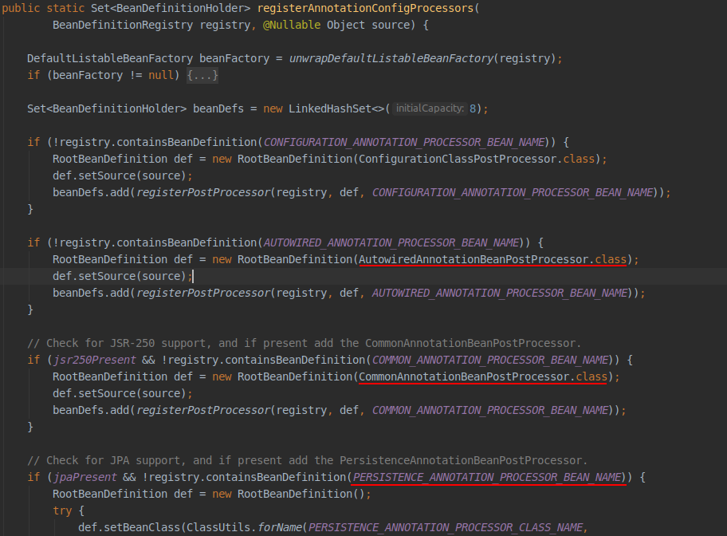
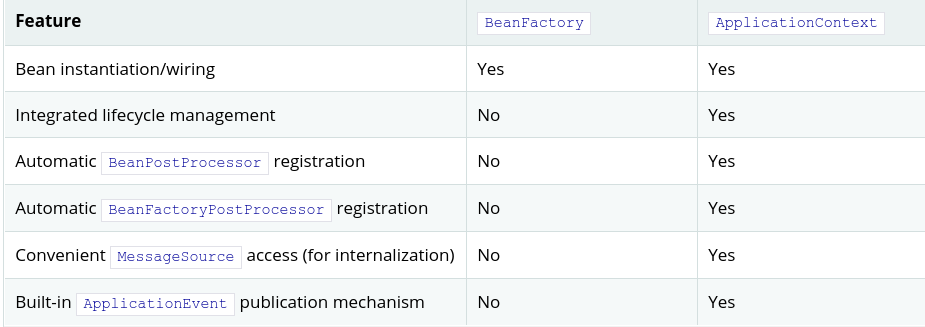

# Spring  核心技术

本章主要讲述spring框架必不可少的技术。其中最重要的是spring框架的控制反转（IoC）和面向方面编程（AOP）。

## 1.IoC

- IoC 也称作依赖注入（DI）。
- 使用构造函数、工厂方法的参数、或在对象实例上设置属性来定义其依赖的过程
- 主要作用降低代码的耦合.将对象所依赖的对象交给容器注入.
- 底层原理: xml 配置, 工厂模式, 反射

`org.springframework.beans` 和 `org.springframework.context` 是IoC容器的基础。 
`BeanFactory` 接口提供了一种可以管理任何类型对象的配置机制。
`ApplicationContext`是它的子类，提供了额外的功能：

- 更容易于AOP集成
- 消息资源处理（国际化）
- 事件发布
- 应用层特定的上下文（如 WebApplicationContext）
- 

## 2.容器

`org.springframework.context.ApplicationContext` 接口代表了IoC容器，它负责实例化，配置和装配Bean。
容器根据读取配置元数据（如xml配置文件）获取需要实例化哪些对象，并根据配置进行配置和注入依赖。


下图说明了配置元数据、容器和业务对象之间的关系。容器通过读取配置文件元数据将业务对象加载到容器中后，系统就可以直接使用这些业务对象了。


### 2.1元数据的配置

spring的配置可以采用多种方式，而XML文件是最为传统的配置方式。Spring还可以采用：

- 基于注解的方式进行配置：spring 2.5 引入
- 基于Java-code 的方式进行配置：spring 3.0 允许使用基于`@Configuration`、`@Bean`、`@Import`、`@DependsOn`等注解使用java代码进行配置。


基于XML的配置文件格式如下：

```xml
<?xml version="1.0" encoding="UTF-8"?>
<beans xmlns="http://www.springframework.org/schema/beans"
    xmlns:xsi="http://www.w3.org/2001/XMLSchema-instance"
    xsi:schemaLocation="http://www.springframework.org/schema/beans
        http://www.springframework.org/schema/beans/spring-beans.xsd">

    <bean id="..." class="...">   
        <!-- collaborators and configuration for this bean go here -->
    </bean>

    <bean id="..." class="...">
        <!-- collaborators and configuration for this bean go here -->
    </bean>

    <!-- more bean definitions go here -->

</beans>
```

上面的xml中配置了两个Bean，它们包含在<beans> 元素中。 每个bean中都有 一个id和class属性。

```
id：用于表示单个bean定义的字符串
class：定义bean的类型，并使用全限定名称。
```


### 2.2 实例化容器

spring 的容器提供了对应的方法去读取配置文件来实例化一个容器。

```java
ApplicationContext context = new ClassPathXmlApplicationContext("ApplicationContext.xml");
```


#### 2.2.1 实例

新建一个maven项目，如下：


##### PersonController

```java
public class PersonController {

    private PersonService personService;

    public void setPersonService(PersonService personService) {
        this.personService = personService;
    }

    public void getPersion() {
        personService.getPersonById("123123");
    }

}
```

##### PersonService

```java
public interface PersonService {
    void getPersonById(String id);
}
```

##### PersonServiceImpl

```java
public class PersonServiceImpl implements PersonService {

    private PersonDao dao;

    public void setDao(PersonDao dao) {
        this.dao = dao;
    }

    @Override
    public void getPersonById(String id) {
        dao.getPersonById(id);
    }
}
```

##### PersonDao

```java
public interface PersonDao {
    void getPersonById(String id);
}
```

##### PersonDaoImpl

```java
public class PersonDaoImpl implements PersonDao {
    @Override
    public void getPersonById(String id) {
        System.out.println("person dao impl get person by id " + id);
    }
}
```

##### ApplicationContext.xml

```xml
<?xml version="1.0" encoding="UTF-8"?>
<beans xmlns="http://www.springframework.org/schema/beans"
       xmlns:xsi="http://www.w3.org/2001/XMLSchema-instance"
       xsi:schemaLocation="http://www.springframework.org/schema/beans http://www.springframework.org/schema/beans/spring-beans.xsd">
    <bean id="personController" class="com.dreamsrj.controller.PersonController">
        <!--通过setter注入-->
        <property name="personService" ref="personService"/> 
    </bean>

    <bean id="personService" class="com.dreamsrj.service.PersonServiceImpl">
        <!--通过setter注入-->
        <property name="dao" ref="personDao"/>
    </bean>

    <bean id="personDao" class="com.dreamsrj.dao.PersonDaoImpl"/>
</beans>
```


##### Test

```java
@Test
public void test() {
    //通过加载配置文件实例化容器
    ApplicationContext context = new ClassPathXmlApplicationContext("ApplicationContext.xml");
    //获取配置文件中定义的bean
    String[] beanDefinitionNames = context.getBeanDefinitionNames();
    System.out.println(Arrays.toString(beanDefinitionNames));

    //第一次从容器中获取实例
    PersonController personController = context.getBean(PersonController.class);
    personController.getPersion();
    //第二次从容器中获取实例
    PersonController personController2 = context.getBean(PersonController.class);
    personController.getPersion();

    //显示true， 容器中的bean默认为单例。
    System.out.println("get twice person controller is equeal : " + (personController == personController2));
}
```


##### 输出结果

```log
[personController, personService, personDao]
person dao impl get person by id 123123
person dao impl get person by id 123123
get twice person controller is equeal : true
```


根据上面的代码可以明显看出，在代码中没有实际创建对象实例，但是在我们需要使用的时候就已经可以使用了。

这是因为Spring在启动的时候，会根据配置元数据创建对象，并将对象所依赖的对象也创建好，并装配好。

==Note==

> 下面的配置，使用了setter进行注入，也就是说`PersonServiceImpl`中的`setPersonDao（...）`方法必须存在，否则无法装配。

```xml
 <bean id="personService" class="com.dreamsrj.service.PersonServiceImpl">
        <!--通过setter注入-->
        <property name="dao" ref="personDao"/>
    </bean>
```


## 3.Bean

Spring IoC 容器管理一个或多个bean。 这些Bean根据程序提供的配置元数据创建。

在容器中， 这些bean的定义使用`BeanDefinition`的实例对象表示，其中包含以下数据：

- 一个全限定类名：通常定义Bean的实际实现类
- Bean的行为配置元素
- 依赖项：当前bean工作需要使用的其他bean
- 其他需要在创建的bean上进行设置的配置项，例如连接池的大小


### 3.1 bean的属性

- Class  定义bean的实现类型
- Name 定义bean的名称，容器中唯一
- Scope bean的实例化范围，例如 单例
- Contructor arguments 构造器参数
- Properties 实现类的属性
- Autowiring mode 装配模式
- Lazy initialization mode 懒加载模式
- Initialization method 初始化方法
- Destruction method 销毁方法


### 3.2 给 Bean 命名

通常使用 `id`或`name`来定义bean的标识符，这些标识符在承载Bean的容器内必须是唯一的。 但是同一个bean可以定义多个名称，如果需要的话。其他定义的名字被当做别名使用。

如下：id 中包含了两个名称

```xml
<bean id="lisi，jack" class="com.dreamsrj.Person"/>
```

同时，spring允许使用标签为其他地方定义的Bean定义一个别名：

```xml
<alias name="fromName" alias="toName"/>
```


### 3.3 Bean的实例化

一个Bean的定义，实际就是描述如何创建这个bean所表示的类的实例。当访问这个Bean或使用这个Bean的时候，容器会检查Bean的定义，去创建或获取一个实例对象。


在xml中，通过`<bean>`标签的`class`属性来指定需要实例化的类型，通常该属性是强制必须指定的。


该属性的两种使用方法

- 通常情况下，指定class属性会通过反射的方式创建bean的实例，这有点像直接通过 `new` 操作符进行创建。
- 调用class属性指定类型的 `static`方法创建对象，这种情况下，容器会调用该类型的静态工厂方法创建对象，而该工厂方法返回的对象的类型可以是一样的，也可以是完全不同的。

> 内部类
>
> 如果想要定义一个静态内部类的Bean，必须使用嵌套类的下二进制名称。
>
> 例如：`com.example.SomeThing` 中定义了一个静态嵌套类`OtherThing`，那么定义该嵌套类的Bean时，class属性需要如下配置：`com.example.SomeThing$OtherThing`。 
>
> ==note== 这里使用 $ 分割了两个类的名称


##### 通过构造函数实例化Bean

Spring IoC容器可以管理任何类型的bean。 但是取决于你使用的IoC的特定的类型，你的bean需要有一个默认的构造器（空构造器）。

如下配置方式，Spring会自动调用类的默认构造器。

```xml
<bean id="exampleBean" class="examples.ExampleBean"/>
```


##### 静态工厂方法实例化Bean

在使用静态工厂方法创建对象的时候，在class属性中指定的是还有静态工厂方法的类型，然后使用`factory-method`属性指定工厂方法的名称。

```xml
<bean id="staitcFactoryMethod" class="com.dreamsrj.factory.ObjectFactory"  
      factory-method="createInstance"/>
```


##### 实例工厂方法实例化bean

```xml
<bean id="serviceLocator" class="examples.DefaultServiceLocator">
    <!-- inject any dependencies required by this locator bean -->
</bean>

<bean id="clientService"
    factory-bean="serviceLocator" 
    factory-method="createClientServiceInstance"/>

<bean id="accountService"
    factory-bean="serviceLocator"
    factory-method="createAccountServiceInstance"/>
```


## 4.依赖关系

依赖注入是一个过程，通过该过程，对象仅通过构造函数，工厂方法的参数或在构造对象实例后，在对象实例上设置属性来定义起依赖关系。然后容器在创建bean时注入这些依赖，


依赖注入的优势：

- 代码更加简洁

- 低耦合

- 更加易于测试， 允许使用模拟实现

  测试类==

  ```java
  package com.dreamsrj.di;
  
  public class User {
      private String name;
      private int age;
      private Address address;
  
      public User() {    }
  
      public User(String name, int age, Address address) {
          this.name = name;
          this.age = age;
          this.address = address;
      }
  	//setter
      ......
  }
  class Address {
      private String address;
  
      public String getAddress() {
          return address;
      }
      //setter
      ......
  }
  
  ```

  

###　4.1 基于构造函数注入

基于构造函数的Di是通过容器调用具有多个参数的构造函数来实现，每个参数代表一个依赖。

这于调用静态的带有特定参数的工厂方法来构造bean几乎是一样的。

====基于构造器参数名称进行注入==

```xml
<bean name="address" class="com.dreamsrj.di.Address">
    <property name="address" value="四川省成都市天赋新区"/>
</bean>

<!--constructor with arg-name -->
<bean name="userOne" class="com.dreamsrj.di.User">
    <constructor-arg name="name" value="dreamsrj"/>
    <constructor-arg name="age" value="28"/>
    <constructor-arg name="address" ref="address"/>
</bean>
```

==基于构造其参数下标==

```xml
<bean name="address" class="com.dreamsrj.di.Address">
    <property name="address" value="四川省成都市天赋新区"/>
</bean>

<bean name="userTwo" class="com.dreamsrj.di.User">
    <constructor-arg index="0" value="dreamsrj"/>
    <constructor-arg index="1" value="29"/>
    <constructor-arg index="2" ref="address"/>
</bean>
```

如果构造器参数类型存在歧义时，可以使用多种手段帮助spring确定参数类型。

- 使用 `type` 属性

  ```xml
  <bean name="userTwo" class="com.dreamsrj.di.User">
      <constructor-arg type="java.lang.String" value="dreamsrj"/>
      <constructor-arg type="int" value="29"/>
      <constructor-arg type="com.dreamsrj.di.Address" ref="address"/>
  </bean>
  ```

- 使用 `index` 属性明确指定参数位置

  ```xml
  <bean name="userTwo" class="com.dreamsrj.di.User">
      <constructor-arg index="0" value="dreamsrj"/>
      <constructor-arg index="1" value="29"/>
      <constructor-arg index="2" ref="address"/>
  </bean>
  ```

- 使用 `name` 属性明确注入参数到哪个参数

  ```xml
  <bean name="userOne" class="com.dreamsrj.di.User">
      <constructor-arg name="name" value="dreamsrj"/>
      <constructor-arg name="age" value="28"/>
      <constructor-arg name="address" ref="address"/>
  </bean>
  ```

  ==注意==

  使用参数名称的方式，必须在 Debug 模式下编译代码，spring才可以根据参数名称进行查找。如果不使用Debug模式进行编译，那么必须使用`@ConstructorProperties`注解显示指定参数名称

  ```xml
  @ConstructorProperties({"name","age","address"})
      public User(String name, int age, Address address) {
          this.name = name;
          this.age = age;
          this.address = address;
      }
  ```

  

### 4.2 基于setter注入

setter注入器是在容器调用无参构造器或无参数静态工厂方法实例化Bean之后，调用实例对象的set方法进行注入，因此需要注入的属性，必须存在对应的set方法，否则无法注入。

```xml
<!--setter-->
<bean class="com.dreamsrj.di.User">
    <property name="address" ref="address"/>
    <property name="age" value="23"/>
    <property name="name" value="dreamsrj"/>
</bean>
```


基于构造器注入和setter注入可以混合使用，一个好的做法是使用构造器注入必须的属性，使用setter注入可选的属性。 同样，基于setter的注入也可以使用`@Required`注解声明属性是必须的。


### 4.3 依赖解析过程

- 使用描述所有bean的元数据创建和初始化`ApplicationContext`容器，配置元数据可以是xml、注解、java code.
- 没一个bean的依赖都使用属性、构造参数、静态方法参数表示.当bean被实际创建的时候，才提供这些依赖.
- 没一个属性、构造参数都是一个实际定义的值，或是引用其他的bean
- 没一个属性或构造参数的值都会从指定的格式转换为它实际的类型。spring默认支持将字符串格式值转换为内置类型的之，例如：int long String 等等。

spring 容器会验证容器中没一个bean配置，但是只会在实际创建的时候才会注入bean需要的属性。默认情况下spring会在容器创建后立即创建singleton-scope 和 pre-instantiated的bean（默认的）。在创建bean的时候会创建一个bean图，他会创建这个bean所依赖的所有的bean，以及依赖的依赖。


==注意== 

注入类型的不匹配可能会发现的较晚，即在第一次创建时发现。 单例默认在容器初始化时创建。


==循环依赖==

在使用构造器注入时，可能造成循环依赖，例如A依赖B，B也依赖A，如果他们都使用构造器注入彼此，此时spring在运行是会抛出`BeanCurrentlyInCreateionException`异常。 一个解决方法是使用setter注入替代，虽然不推荐循环依赖。 先有鸡还是先有蛋？


# 5 Bean Scope

bean的范围规定了bean的使用范围。

spring支持六种范围。

- signleton
- prototype
- request
- session
- Application
- webSocket

## 5.1 Singleton

该范围的bean只有一个共享实例。全局范围内，任何时候获取到的都是同一个Bean实例对象。

单例范围是spring的默认范围。所以不指定范围时，就是单例。


## 5.2 Prototype

每次获取原型范围的bean时，都会立即创建一个新的实例对象。通常有状态的bean都应该是原型的。无状态的bean是单例的。

原型范围的bean的销毁有客户端自己处理，spring容器不会管理其销毁。


## 5.3 Request、Session、WebSocket


# Spring 如何创建对象

spring 默认使用无参构造器创建对象。


## 创建对象的时机

- spring对于singleton类型的bean在初始化容器的时候进行创建，并创建其依赖的bean。
- spring对于prototype类的的bean在使用的时候创建，并且每次使用都创建一个全新的bena。
- 


# 生命周期回调

如果需要在容器管理的bean的生命周期中实现自己的业务，可以通过实现`InitializingBean` 和 `DisposableBean` 接口。容器会在初始化bean和销毁bean时调用接口中的 `afterPropertiesSet()` 和 `destroy()`。

==Note==

在实际开发中，通常通过`@PostConstruct`和`@PreDestory`注解来代替初始化和销毁回调。


在spring框架内部使用`BeanPostProcessor `实现类处理它能够找到的所有的回调接口并调用对应的方法。如果spring没有提供你需要的生命在周期行为，可以通过实现`BeanPostprocessor`接口来实现自己的生命周期回调。


除了初始化 和销毁回调，Spring还提供`LifeCycle`接口用于让Spring管理的Bean参与到容器的启动和停止过程中


## 初始化回调

实现 `org.springframework.beans.factory.InitializingBean` 接口可以在容器创建Bean并设置必要的属性之后，调用其`afterPropertiesSe()`方法。

==Person==

```java
public class Person implements InitializingBean {
    private String name;
    private int age;
    private int height;

    public Person() {
        System.out.println("创建Person实例...");
    }

    public String getName() {
        return name;
    }

    public void setName(String name) {
        this.name = name;
        System.out.println("set person name " + name);
    }

    public int getAge() {
        return age;
    }

    public void setAge(int age) {
        this.age = age;
        System.out.println("set person age " + age);
    }

    public int getHeight() {
        return height;
    }

    public void setHeight(int height) {
        this.height = height;
        System.out.println("set person height " + height);
    }

    @Override
    public void afterPropertiesSet() throws Exception {
        System.out.println("call afterPropertiesSet() ....");
    }
}
```

==lifecycle-callback.xml==

```xml
<bean id="use" class="com.dreamsrj.lifycycle.Person">
     <property name="name" value="lisi"/>
     <property name="age" value="23"/>
     <property name="height" value="178"/>
</bean>
```

==test==

```java
@Test
public void testInitAndDestroy() {
    System.out.println("Start --------------------------------");
    //通过加载配置文件实例化容器
    ApplicationContext context = new ClassPathXmlApplicationContext("lifecycle-callback.xml");
    System.out.println("End   --------------------------------");
}
```

==output==

```
Start --------------------------------
创建Person实例...
set person name lisi
set person age 23
set person height 178
call afterPropertiesSet() ....
End   --------------------------------
```

`call afterPropertiesSet() ....` 输出在所有属性设置完之后，说明该方法是在所有依赖注入之后再调用。


### 最佳操作

spring并不建议直接实现该`InitializingBean`接口，因为spring的代码会侵入到我们的代码中。spring推荐使用`@PostConstruct`注解或在bean配置中使用`init-method`属性指定初始化方法（初始化方法必须是void返回值，无参数的方法）或在javacode配置中使用`@Bean`注解中的`initMethod`属性指定初始化方法。

#### init-method

```java
public void init(){
    System.out.println("call init() by init-method");
}
```


```xml
<bean id="use" class="com.dreamsrj.lifycycle.Person" init-method="init">
    <property name="name" value="lisi"/>
    <property name="age" value="23"/>
    <property name="height" value="178"/>
</bean>
```

#### initMethod

```java
@Bean(initMethod = "init()")
```


#### @PostConstruct

```java
@PostConstruct
public void init(){
    System.out.println("call init()");
}
```

该注解在1.9及以后被移除，如果需要使用需要单独引入其他包。且该注解的使用需要开启注解扫描。

如：`<context:annotation-config/>`


如果多种初始化回调在同一个bean配置，且方法名称不相同，那么他们的执行熟悉是：

1. 首先执行 @PostConstruct 注解指定的方法
2. 其次调用实现 `InitializingBean`接口的 `afterPropertiesSet()`方法
3. 最后调用自定义的 init() 方法(initMethod/init-method)

销毁毁掉与初始回调的顺序一致。


## 容器启动/停止回调


# Aeare 接口

## ApplicationContextAware

如果spring管理的Bean实现了该接口，那么容器在创建该Bean的实例时，会将`ApplicationContext`实例对象的引用传递到该类。可以在该类中利用`ApplicationContext`对象做一些特殊操作.

```java
public interface ApplicationContextAware extends Aware {
	void setApplicationContext(ApplicationContext applicationContext) throws BeansException;
}
```


示例

-------------------

```java
public class SpringContextUtils implements ApplicationContextAware {
    private ApplicationContext context;

    @Override
    public void setApplicationContext(ApplicationContext applicationContext) throws BeansException {
        context = applicationContext;
    }

    public Object getBean(String name) {
        return context.getBean(name);
    }

    public Object getBean(Class clasz) {
        return context.getBean(clasz);
    }
}
```


说明

---

获取`ApplicationContext`对象的引用的另外一种选择时使用自动装配. 通过类型装配的方式可以在构造器参数,setter方法参数传入该`ApplicationContext`对象的引用.


## BeanNameAware

当Bean实现该接口时,在容器创建Bean实例时可以获取到bean的名称. Spring并不推荐使用该接口,因为会耦合Spring的API. 

该接口的调用时机在实例设置完属性(注入)之后, 在调用初始化方法前.

```java
public interface BeanNameAware extends org.springframework.beans.factory.Aware {
    void setBeanName(java.lang.String s);
}
```

示例

---

```java
public class TestBeanNameAware implements BeanNameAware {
    private String beanName;

    private String prop;

    public String getProp() {
        return prop;
    }

    public void setProp(String prop) {
        this.prop = prop;
        System.out.println("set prop");
    }

    public TestBeanNameAware() {
        System.out.println("Create instance for TestBeanNameAware ...");
    }

    /**
     * 该方法在设置玩属性值之后, 调用, 在初始化方法之前调用
     *
     * @param s
     */
    @Override
    public void setBeanName(String s) {
        beanName = s;
        System.out.println("Bean name is : " + beanName);
    }

    public void init() {
        System.out.println("init TestBeanNameAware ...");
    }

}
```

结果如下:

```txt
Create instance for SpringContextUtils ... 
context is null ? org.springframework.context.support.ClassPathXmlApplicationContext
Create instance for TestBeanNameAware ...
set prop  >1
Bean name is : testBeanNameWare >2
init TestBeanNameAware ... >3
```


## 其他Aware子接口

- ApplicationEventPublisherAware
- BeanClassLoaderAware
- BeanFactoryAware
- BootstrapContextAware
- LoadTimeWeaverAware
- MessageSourceAware 
- NotificationPublisherAware
- ResourceLoaderAware 
- ServletConfigAware 可以获取到当前web应用中的`ServletConfig`引用
- ServletContextAware 可以获取到当前web应用中的`ServletContext`引用

注意

---

使用这些接口会使你的代码和Spring的代码耦合在一起,违反IoC. 建议只在需要访问Spring结构的基础Bean中使用


# Bean定义继承

一个Bean的定义可以包含很多的信息, 一个子Bean的定义可以父Bean继承配置信息. 子Bean的定义可以重写父Bean的配置信息或添加一下配置信息.


# 容器扩展点

通常不需要去开发`ApplicationContext`的子类来扩展Spring. Spring 提供了一些接口用来集成特殊的功能.


## 使用`BeanPostPorcessor`自定义Bean

该接口定义了一些接口,可以让开发人员提供自己的Bena实例话逻辑, 依赖解析逻辑,和初始化逻辑. 如果想在Spring容器完成实例化,配置,初始化操作后,实现自己的逻辑,可以通过插入一个或多个`BeanPostPorcessor`实现类完成.

如果配置了多个`BeanPostProcessor`, 可以通过设置 order 属性来控制执行的顺序, 这需要实现 `Ordered`接口才可以实现执行顺序的控制. 

注意

----

BeanPostProcessor 按容器划分作用域. 也就是说, BeanPostProcessor 只处理与它定义在同一个容器内的Bean.

```java
public interface BeanPostProcessor {
    @org.springframework.lang.Nullable
    default java.lang.Object postProcessBeforeInitialization(java.lang.Object bean, java.lang.String beanName) throws org.springframework.beans.BeansException { /* compiled code */ }

    @org.springframework.lang.Nullable
    default java.lang.Object postProcessAfterInitialization(java.lang.Object bean, java.lang.String beanName) throws org.springframework.beans.BeansException { /* compiled code */ }
}
```


`BeanPostProcessor`定义了两个回调方法, 当这样一个Bean作为一个后置处理器被注册到容器中时, 每一个容器创建的Bean都会回调其定义的两个回调方法. 

回调的时机:

- 在调用初始化方法之前调用 `postPorocessBeforeInitialization(Object bean, String beanName)`
- 在调用初始化方法之后调用`postProcessAfterInitialilization(Object bean, String beanName)`

 后置处理器通常会检查回调接口, 或者使用代理包装bean. 一些spring AOP 的基础结构类被实现为一个 Bean post-processor 用于提供(代理-包装)逻辑.


容器会自动检测定义在配置元数据中的 BeanPostProcessor 接口. ApplicationContext 会注册这些后置处理器然后在创建Bean的时候调用起回调方法.


 BeanPostProcessor 与自动代理

---

实现`BeanPostProcessor`接口的Bean容器会进行特殊的处理. 其所有的实例和bean的直接依赖都在容器启动时实例化. 然后会有序的注册这些bean, 将其应用到后续创建的Bean上. 因为AOP自动代理是基于`BeanPostProcessor`实现的,所以其实例和其直接依赖的Bean都不适合使用自动代理,因此没有切面编织它们.


对于`BeanPostProcessor` 在容器启动时会有如下日志输出:

```log
Bean someBean is not eligible for getting processed by all BeanPostProcessor interfaces (for example: not eligible for auto-proxying)
```

提示  someBean 这个bean没有资格执行所有的后置处理器.


示例 : `RequiredAnnotationBeanPostProcessor`

---

将回调接口或注解与一个自定义的`BeanPostProcessor`实现结合是扩展Spring容器的常用方法. 一个实际的案例就是`RequiredAnnotationBeanPostProcessor` - 一个 `BeanPostProcesser`的实现, 用于确保JavaBean属性中被注解标记的属性被真正注入了一个值.


## 自定义配置元数据 BeanFactoryPostProcessor

`BeanFactoryPostProcessor`  在语义学上与`BeanPostProcessor`相似, 一个小的区别是: `BeanFactoryPostProcessor` 是用来操作配置元数据的, 也就是说,Spring运行开发人员在spring初始化除`BeanFactoryPostProcessor`之外的其他Beans之前读取或修改配置元数据.


和后置处理器一样, Bean工厂后置处理器可以配置多个, 并且可以控制其执行顺序通过实现 `Ordered` 接口. 

当Bean 工厂后置处理器定义在一个 ApplicationContext 中时, 他会自动执行,为了将处理器中的逻辑应用到配置在当前容器中的配置元数据上. spring中包含了很多预定义的处理器, 例如 `PropertyOverrideConfigurer`, `PropertySourcesPlaceholderConfigurer`. 


ApplicationContext 会自动检测任何定义在其中的实现了工厂后置处理器接口的Bean.  所以可以像其他普通bean一样定义.


后置处理器会忽略配置的所有的lazy配置.


示例: `PropertySourcesPlaceholderConfigurer`

---

`PropertySourcesPlaceholderConfigurer` 运行讲Bean的属性值外置到一个.properties 格式的属性文件中. 当切换环境时可以直接切换外部文件即可, 而不需要对原有配置文件进行修改而承担风险.

```xml
<bean class="org.springframework.context.support.PropertySourcesPlaceholderConfigurer">
    <property name="locations" value="classpath:com/something/jdbc.properties"/>
</bean>

<bean id="dataSource" destroy-method="close"
        class="org.apache.commons.dbcp.BasicDataSource">
    <property name="driverClassName" value="${jdbc.driverClassName}"/>
    <property name="url" value="${jdbc.url}"/>
    <property name="username" value="${jdbc.username}"/>
    <property name="password" value="${jdbc.password}"/>
</bean>
```


Spring 2.5 之后可以使用如下配置方式:

```xml
<context:property-placeholder location="classpath:com/something/jdbc.properties"/>
```


当无法在指定的文件中找到对应的属性, 它将会在Spring的`Environment` , Java的 `System`中查找相应的属性.


## 通过 FactoryBean 自定义实例化逻辑

`FactoryBean` 提供了三个接口用于自定义实例化逻辑:

- Object getObject() 返回工厂创建的对象实例. 这个实例有可能是共享的, 取决于工厂是否返回的单例或原型
- boolean isSingleton() 当工厂返回的对象是单例时,返回true, 否则返回false
- Class getObjectType() 返回getObject()方法返回的对象的类型. 如果不知道是何类型,返回null


# 基于注解的容器配置

基于注解的配置提供了xml配置的替代, 它使用字节码元数据进行配置,取消了xml配置时的冗长. 注解配置将配置内容迁移到一个配置组件类中,然后在该类上,方法上,属性上使用相应的注解. 例如:使用 `RequiredAnnotationBeanPostProcessor` 结合 `@Required` 注解限制Bean的属性必须注入值.


> 注解注入在XML注入之前执行, 当两种配置都存在与同一个Bean时, XML的注入会覆盖基于注解的配置.


下面的XML隐式注册了注解的处理器.

```xml
<?xml version="1.0" encoding="UTF-8"?>
<beans xmlns="http://www.springframework.org/schema/beans"
    xmlns:xsi="http://www.w3.org/2001/XMLSchema-instance"
    xmlns:context="http://www.springframework.org/schema/context"
    xsi:schemaLocation="http://www.springframework.org/schema/beans
        https://www.springframework.org/schema/beans/spring-beans.xsd
        http://www.springframework.org/schema/context
        https://www.springframework.org/schema/context/spring-context.xsd">

    <context:annotation-config/>

</beans>
```

隐式注册的后置处理器包括: `AutowiredAnnotationBeanPostProcessor`, `CommonAnnotationBeanPostProcessor`, `PersistenceAnnotationBeanPostProcessor`, `RequiredAnnotationBeanPostProcessor` 等.


Source-Code

---

`org.springframework.context.annotation.AnnotationConfigUtils`

`registerAnnotationConfigProcessors()`




---

`<context:annotation-config/>` 只在检测相同的应用上下文中的注解. 也就是说,如果在`WebApplicationContext`中定义的`<context:annotation-config/>`, 那么它不会检测 `ApplicationContext`上线问中定义的其他注解.

---


## @Required


```java
public class SimpleMovieLister {

    private MovieFinder movieFinder;

    @Required
    public void setMovieFinder(MovieFinder movieFinder) {
        this.movieFinder = movieFinder;
    }

    // ...
}
```

 该注解用于标记Bean的一个属性必须注入一个明确的值,防止发生类似`NullPointerException` 这样的错误, 导致在运行期间才能发现错误.

---

该注解在Spring5.1中被标记为过时, 不在建议使用.  建议使用构造器注入必要的属性, 或自定义`InitializingBean.afterPropertiesSet()`检测.


## @Autowired

`@Inject` 可以代替 `@Autowired`注解.

- 在构造器上使用

```java
public class MovieRecommender {

    private final CustomerPreferenceDao customerPreferenceDao;

    @Autowired
    public MovieRecommender(CustomerPreferenceDao customerPreferenceDao) {
        this.customerPreferenceDao = customerPreferenceDao;
    }
}
```

- 在setter上使用

```java
public class SimpleMovieLister {

    private MovieFinder movieFinder;

    @Autowired
    public void setMovieFinder(MovieFinder movieFinder) {
        this.movieFinder = movieFinder;
    }
}
```


- 在方法上使用

```java
public class MovieRecommender {

    private MovieCatalog movieCatalog;

    private CustomerPreferenceDao customerPreferenceDao;

    @Autowired
    public void prepare(MovieCatalog movieCatalog,
            CustomerPreferenceDao customerPreferenceDao) {
        this.movieCatalog = movieCatalog;
        this.customerPreferenceDao = customerPreferenceDao;
    }
}
```


- 直接在属性上使用, 甚至和构造器混合

```java
public class MovieRecommender {

    private final CustomerPreferenceDao customerPreferenceDao;

    @Autowired
    private MovieCatalog movieCatalog;

    @Autowired
    public MovieRecommender(CustomerPreferenceDao customerPreferenceDao) {
        this.customerPreferenceDao = customerPreferenceDao;
    }
}
```

- 在集合或数组上使用

```java
public class MovieRecommender {
    @Autowired
    private MovieCatalog[] movieCatalogs;
}

// ---
public class MovieRecommender {
    private Set<MovieCatalog> movieCatalogs;
    @Autowired
    public void setMovieCatalogs(Set<MovieCatalog> movieCatalogs) {
        this.movieCatalogs = movieCatalogs;
    }
}
```

如果在集合或数组上使用 `@Autowired` , spring会将容器中所有该类型的Bean都注入到集合中, 默认按照声明顺序注入. 如果希望bean按照特定顺序注入, 可以实现`Ordered`接口或`@Order`注解 或 使用 `javax.annotation.Priority` 注解.


@Priority 只能用于类级别上,  @Order 可以用于类级别也可以用于@Bean标记的方法级别上.

### 使用@Primary微调自动注入

当spring容器根据类型获取到多个可以注入的Bean,且被注入的是一个单个值(非数组/集合)时, 使用@Primary 标注的Bean会被注入.

`@Primary`用于在使用基于类型自动注入时,获取到多个实例Bean. 此时被标注为 Primary Bean会被注入.

### 使用@Qualifiers 调整自动注入

`@Qualifiers` 可以在根据类型自动注入时提供更精确的控制,  他可以根据指定的Bean的名称,注入希望注入的Bean.

```java
public class MovieRecommender {

    @Autowired
    @Qualifier("main")  //注入BeanName 为 main 的Bean
    private MovieCatalog movieCatalog;
}
```

`@Qualifiers` 注解可以用于属性, 构造器参数, 方法参数上.


在使用根据类型注入时,使用限定值根据名称进行选择, 不需要使用`@Qualifiers` 注解. 如果在非唯一匹配对象时,Spring使用当前注入点的名称(属性名, 方法参数名..)匹配bean的名称, 如果匹配则注入.


如果在使用注解驱动的依赖注入时使用Bean的名称来注入,那么不要主要使用@Autowired 注解, 即使它可以根据名称查找到符合条件的对象.  而是使用 JSR-250 中的 `@Resource`注解, 这个注解根据名称鉴定一个唯一的对象,而与声明的类型不相干.

@Autowired 有不同的语义: 根据类型查找到候选对象, 然后再根据名称查找符合限定值的Bean.

## @Resource

- `@Resource` 注解可以使用在属性或setter方法上
- `@Resource` 注解通过Bean名称进行注入
- 如果 `@Resource` 注解没有指定 name 属性, 那么Spring根据被注解的属性或setter分析名称,  注解在field上, fieldname被当做 Beanname, 如果注解在setter上, 那么属性名称就是Beanname.

```java
public class SimpleMovieLister {

    private MovieFinder movieFinder;

    @Resource
    public void setMovieFinder(MovieFinder movieFinder) {
        this.movieFinder = movieFinder;
    }
}
```


## @Value

通常用于注入外置的属性值

```java
@Component
public class MovieRecommender {

    private final String catalog;

    public MovieRecommender(@Value("${catalog.name}") String catalog) {
        this.catalog = catalog;
    }
}

@Configuration
@PropertySource("classpath:application.properties")
public class AppConfig { }
```


Spring 提供了一个默认的属性值解析器, 它会尝试去解析值并注入到属性中, 如果解析失败,那么属性名称( `${catalog.name}` )将作为值注入到属性中.


如果想要严格控制不存在的值, 可以配置一个 `PropertySourcesPlaceholderConfigurer` Bean.	 

配置`PropertySourcesPlaceholderConfigurer`的方法必须是 `static` 的

```java
@Configuration
public class AppConfig {

     @Bean
     public static PropertySourcesPlaceholderConfigurer propertyPlaceholderConfigurer() {
           return new PropertySourcesPlaceholderConfigurer();
     }
}
```

PropertySourcesPlaceholderConfigurer 在无法解析属性值时, Spring初始化会抛出异常.

spring 提供的内置转换支持允许自动的将String转换为目标类型, 将 逗号 分割的字符串转换为数组操作.


@Value 支持提供默认值, 如下:

```java
@Component
public class MovieRecommender {

    private final String catalog;

    public MovieRecommender(@Value("${catalog.name:defaultCatalog}") String catalog) {
        this.catalog = catalog;
    }
}
```

Spring 的  `BeanPostProcessor` 在后台使用 `ConversionService` 处理类型转换, 如果希望实现自己的转换逻辑,可以通过实现该接口来提供自己的转换方法.

```java
@Configuration
public class AppConfig {

    @Bean
    public ConversionService conversionService() {
        DefaultFormattingConversionService conversionService = new DefaultFormattingConversionService();
        conversionService.addConverter(new MyCustomConverter());
        return conversionService;
    }
}
```


@Value 可以使用 EL 表达式.

```java
@Component
public class MovieRecommender {

    private final String catalog;

    public MovieRecommender(@Value("#{systemProperties['user.catalog'] + 'Catalog' }") String catalog) {
        this.catalog = catalog;
    }
}

//更复杂的EL
@Component
public class MovieRecommender {

    private final Map<String, Integer> countOfMoviesPerCatalog;

    public MovieRecommender(
            @Value("#{{'Thriller': 100, 'Comedy': 300}}") Map<String, Integer> countOfMoviesPerCatalog) {
        this.countOfMoviesPerCatalog = countOfMoviesPerCatalog;
    }
}
```


## @PostConstruct & @PreDestroy

Spring 2.5 开始`CommonAnnotationBeanPostProcessor` 中除了注册`@Resource`注解外, 还注册了`javax.annotation.PostConstruct` 和 `javax.annotation.PreDestroy`.   它提供了spring 声明周期回调方法的替代方式.


`CommonAnnotationBeanPostProcessor` 被注册在`ApplicationContext`中,  被这些注解标注的方法与spring生命周期接口方法或明确声明的回调方法被同时调用. 

---

在JDK6-8中, @Resource , @PostConstract @PreDestroy 是标准java类库中的一部分, 但是JDK9 将从JDK核心模块中其拆分.并在JDK11中将其移除.  JDK11中需要使用该注解,需要将 `javax.annotation-api`包引入到类路径中.


# 类路径扫描和组件管理

本节讲述通过扫描类路径隐式检测候选组件. 

## Stereotype Annotations

### @Repository 

是一种特殊的Component, 该注解用于标记类是一个持久化对象的角色或类型(例如:ＤＡＯ). 这个注解的作用之一是翻译异常.

### @Service

是一种特殊的Component, 表示一个服务.

### @Controller

是一种特殊的Component

### @Component

该注解是一种通用的注解, 表示任何spring管理的Bean.


---

使用专业的注解可以更好的使用切面.


## 使用元注解和组合注解

Spring提供的很多注解都可以当做元注解使用, 元注解是可以用来标记其他注解的注解. 例如: @Service 注解使用之前的@Component注解进行注解.

```java
@Target({ElementType.TYPE})
@Retention(RetentionPolicy.RUNTIME)
@Documented
@Component  //(1)
public @interface Service {
	@AliasFor(annotation = Component.class)
	String value() default "";
}
```

(1) Component 导致 @Service 与@Component处理方式一样.


Spring允许自己通过组合元注解形成自己的新的注解, 例如Spring使用 `@Controller` 和`@ResponseBody`组合形成的`@RestController`注解

```java
@java.lang.annotation.Target({java.lang.annotation.ElementType.TYPE})
@java.lang.annotation.Retention(java.lang.annotation.RetentionPolicy.RUNTIME)
@java.lang.annotation.Documented
@org.springframework.stereotype.Controller
@org.springframework.web.bind.annotation.ResponseBody
public @interface RestController {
    @org.springframework.core.annotation.AliasFor(annotation = org.springframework.stereotype.Controller.class)
    java.lang.String value() default "";
}
```


## 自动检测类 & 注册Bean定义

Spring 可以自动检测@Component 注解及使用@Component创建的其他注解所标记的类. 例如:  @Controller, @Service,@Repository.

如果需要开启Spring自动检测, 那么需要在 @Configuration 所标记的类上添加 @ComponentScan 注解.

对应的xml配置如下:

```xml
<context:component-scan base-package="org.example"/>
```


---

`<context:component-scan>` 原始隐式开启了`<context:annotation-config>`. 所以当使用`<context:component-scan>` 时, 可以忽略`<context:annotation-config>`配置.

---

所以当使用 component-scan 元素时, `AutowiredAnnotationBeanPostProcessor` 和 `CommonAnnotationBeanPostProcessor`被隐式包注册容器中.而不需要任何明确的配置.

## 使用Filter 自定义扫描

@ComponentScan 或 component-scan 元素默认可以扫描使用 `@Component`, `@Repository`,`@Service`,`@Controller`,`@Configuration` 所标注的类. 但是可以使用 `includeFilters`,`excludeFilters`属性或`<context:include-filter>`和`<context:exclude-filter>`子元素进行自定义.

每个元素需要一个`type`, 和 `expression`属性. 说明如下:

| Filter Type         | Example                    | Description                                                |
| ------------------- | -------------------------- | ---------------------------------------------------------- |
| annotation(default) | org.example.SomeAnnotation | 在目标的类级别上标注或作用元注解标注的注解                 |
| assignable          | org.example.SomeClass      |                                                            |
| aspectj             | org.example..*Servlet+     | 匹配目标组件的切面表达式                                   |
| regex               | org\.example\.Default.*    | 与目标组件匹配的正则表达式                                 |
| custom              | org.example.MyTypeFilter   | 一个`org.springframework.core.type.TpeFilter`接口的实现类. |


```java
@Configuration
@ComponentScan(
        basePackages = "com.dreams.rj.learn",
        excludeFilters = @ComponentScan.Filter(type = FilterType.ASSIGNABLE_TYPE, classes = UserInfoDao.class),
        includeFilters = @ComponentScan.Filter(type = FilterType.REGEX, pattern = ".*stub.*Repository")
)
public class SpringConfig {
    ...
}
```

其xml版本的配置如下: 

```xml
<beans>
	<context:component-scan base-package="com.dreams.rj.learn">
    	<context:include-filter type="regex" expression=".*stub.*Repository"></context:include-filter>
        <context:exclude-filter type="assignable" expression="com.dreamsrj.dao.PersonDao"></context:exclude-filter>
    </context:component-scan>
</beans>
```

## 在组件中定义Bean的元数据

Spring支持在组件中定义Bean. 你可以和在使用@Configuration组件所标注的类中使用@Bean定义bean一样在组件类中定义Bean.

```java
@Component  //组件类
public class FactoryMethodComponent {

    @Bean  //在组件类中定义bean
    @Qualifier("public") 
    public TestBean publicInstance() {
        return new TestBean("publicInstance");
    }
    public void doWork() {
        // 组件中的特定于应用的方法
    }
}
```


## 为自动检测的Bean命名

默认情况下, Spring使用 `BeanNameGenerator`  进行生产. 而组件对应的 注解都有一个name属性可以指定一个值.

如果没有指定name属性, 默认名称生成器返回非大写的非全限定类名.


### 自定义名称生成器

实现 `BeanNameGenerator`接口 然后在扫描器中注入.

```java
@Configuration
@ComponentScan(basePackages = "org.example", nameGenerator = MyNameGenerator.class)
public class AppConfig {
    // ...
}
```


```xml
<beans>
    <context:component-scan base-package="org.example"
        name-generator="org.example.MyNameGenerator" />
</beans>
```

## 为自定检测的Bean指定范围

和Spring管理的组件一样, 自动检测的组件的默认范围也是单例的. 但是可以使用@Scope 指定其范围.

```java
@Scope("prototype")  //指定范围为原型
@Repository
public class MovieFinderImpl implements MovieFinder {
    // ...
}
```


# 基于java的容器配置

新的Spring中对基于java的配置支持 被`@Configuration`标注的类和使用`@Bean`标注的方法进行配置.

@Bean注解表示该注解标注的方法用于实例化, 配置,初始化一个对象到spring管理的容器中. 与XML配置方式中的`<bean/>`同理. @Bean注解可以使用在任何Spring管理的组件中, 但是通常它在@Configuration标注的类中使用, 表示该类的主要目的是作为一个bean定义的来源. 并且,@Configuration 标注的类中可以通过调用同一个类中其他使用@Bean标注的方法配置bean之间的依赖.


一个简单的@Configuration类定义如下:

```java
@Configuration
public class AppConfig {

    @Bean
    public MyService myService() {
        return new MyServiceImpl();
    }
}
```

其配置等同于下面的xml配置:

```xml
<beans>
    <bean id="myService" class="com.acme.services.MyServiceImpl"/>
</beans>
```


---

==完整的@Configuration与精简的@Bean模式==

当 @Bean 方法没有声明在@Configuration标注的类中时, 它按照一种精简模式进行处理.  @Bean方法在一般@Component 类或简单java类中声明时, 参考精简模式, 这些包含这个方法的类具有不同的组要作用, 而这些@Bean方法在这里有具有一些优势. 

例如, 服务组件可能通过每一个适用的组件类上额外的@bean方法暴露一些管理的视图给容器. 在这种情况下, @Bean方法是一种通用工厂方法机制. 


和@Configuration不同,  精简的@Bean方法无法声明bean之间的依赖, 相反它们依赖被包含的类及其状态进行操作, 甚至可以定义一些变量进行操作. 

这样的@Bean方法不会调用其他的@Bean方法,  每一个这样的方法都只是对特定Bean引用的工厂方法, 没有任何运行时机制, 其正面的影响是, 在运行时没有cglib子类代理, 所以在类设计没有限制.

---

## 构建容器

与`ClassPathXmlApplicationContext`将XML作为输入一样, 使用 `AnnotationConfigApplicationContext`类将@Configuration类作为输入构建一个容器.

```xml
public static void main(String[] args) {
    ApplicationContext ctx = new AnnotationConfigApplicationContext(AppConfig.class);
    MyService myService = ctx.getBean(MyService.class);
    myService.doStuff();
}
```

## 使用 register(Class<?> …)  以编程方式构建容器

如果想使用编程方式构建容器, 可以使用其register方法手动设置.

```java
public static void main(String[] args) {
    AnnotationConfigApplicationContext ctx = new AnnotationConfigApplicationContext();
    ctx.register(AppConfig.class, OtherConfig.class);//
    ctx.register(AdditionalConfig.class); //
    ctx.refresh(); // 
    MyService myService = ctx.getBean(MyService.class);
    myService.doStuff();
}
```


## 开启组件扫描

```java
@Configuration
@ComponentScan(basePackages = "com.acme")  //在配置类中开启组件扫描
public class AppConfig  {
    ...
}
```


也可以使用 `AnnotationConfigApplicationContext` 的scan方法开启组件扫描

```java
public static void main(String[] args) {
    AnnotationConfigApplicationContext ctx = new AnnotationConfigApplicationContext();
    ctx.scan("com.acme"); //开启组件扫描
    ctx.refresh();
    MyService myService = ctx.getBean(MyService.class);
}
```


## 在web项目中使用java配置

```xml
<context-param>
        <!--配置ContextLoaderListener 使用 AnnotationConfigWebApplicationContext 替代默认的 XmlWebApplicationContext-->
        <param-name>contextClass</param-name>
        <param-value>org.springframework.web.context.support.AnnotationConfigWebApplicationContext</param-value>
    </context-param>
    <context-param>
        <!--配置地址可以时一个多个, 多个时使用空格或逗号分割-->
        <param-name>contextConfigLocation</param-name>
        <param-value>com.dreams.rj.learn.config.AppConfig</param-value>
    </context-param>

    <listener>
        <!--该监听器用于引导根应用程序上下文-->
        <listener-class>org.springframework.web.context.ContextLoaderListener</listener-class>
    </listener>

    <servlet>
        <servlet-name>springmvc</servlet-name>
        <servlet-class>org.springframework.web.servlet.DispatcherServlet</servlet-class>
        <init-param>
            <param-name>contextClass</param-name>
            <param-value>org.springframework.web.context.support.AnnotationConfigWebApplicationContext</param-value>
        </init-param>
        <init-param>
            <param-name>contextConfigLocation</param-name>
            <param-value>com.dreams.rj.learn.config.AppConfig, com.dreams.rj.learn.config.WebConfig</param-value>
        </init-param>
    </servlet>

    <servlet-mapping>
        <servlet-name>springmvc</servlet-name>
        <url-pattern>/*</url-pattern>
    </servlet-mapping>
```


```java
//============================================================================
@Configuration
@ComponentScan(basePackages = "com.dreams.rj.learn")
public class WebConfig {

}
//============================================================================
@Configuration
public class AppConfig {

    @Autowired
    private ApplicationContext context;

    @Bean(name = "testBean")
    public TestBean test() {
        TestBean bean = new TestBean();
        bean.setAge(1);
        bean.setName("abc");

        if (context == null) {
            System.out.println("content is null");
        } else {
            String[] names = context.getBeanDefinitionNames();
            for (String name : names) {
                System.out.println("register Bean : " + name);
            }
        }

        return bean;

    }

    @Bean
    public PropertySourcesPlaceholderConfigurer propertySourcesPlaceholderConfigurer(){
        PropertySourcesPlaceholderConfigurer config = new PropertySourcesPlaceholderConfigurer();
        config.setLocations(new ClassPathResource("test.properties"));
        return config;
    }

}
```


# Environment 概念

`Environment` 接口是集成在Spring容器中的抽象概念, 它对应用程序的两个关键方面进行建模: `Profiles` & `Properties`


profiles : 是一个命名的, 只要在活动状态时才将其定义的Bean注册到容器中的逻辑分组. Environment会判断当前哪个profile是处于活动状态, 及哪些profile应该默认是活动的.

Properties  在大多应用程序中都很重要,而且可能有多种来源: properties文件, JVM系统属性, 系统环境变量, JNDI, servlet 上下文参数, Map对象等.   Environment中的Properties角色就是用于提供对这些属性配置和获取的便捷服务.

## profile 概念


### 配置profiles

Spring 核心容器提供了在不同环境使用不同的bean定义配置的机制. 也就是说不同的用户可以做不同的事情, 例如在生产环境和测试环境存在不同的配置.

#### @Profile

该注解用于告诉spring, 在某一个profile激活时该bean的定义有效

==默认配置==

```java
@Configuration
@Profile("default")
public class DefaultConfig {
    @Bean
    public TestBean dataSource() {
        TestBean bean = new TestBean();
        bean.setName("default");
        return bean;
    }
}
```

==开发配置==

```java
@Configuration
@Profile("development")
public class DevelopmentConfig {
    @Bean
    public TestBean dataSource() {
        TestBean bean = new TestBean();
        bean.setName("development");
        return bean;
    }
}
```

==生产配置==

```java
@Configuration
@Profile("production")
public class ProductEnvConfig {
    @Bean
    public TestBean dataSource() {
        TestBean bean = new TestBean();
        bean.setName("production");
        return bean;
    }
}

```


profile字符串可以是一个简单字符串也可以是一个表达式,  profile表达式支持多个profile进行组合

- `!`  否
- `&` 与
- `|` 或

多个之间可以通过括号进行组合.  但是如果没有括号时,不能同时使用 `&` 和`|`.


==@Profile 注解同时也可以用在方法上.==

```java
@Bean
@Profile("default")
public PropertySourcesPlaceholderConfigurer propertySourcesPlaceholderConfigurer(){
    PropertySourcesPlaceholderConfigurer config = new PropertySourcesPlaceholderConfigurer();
    config.setLocations(new ClassPathResource("test.properties"));
    return config;
}
```


#### XML配置

```xml
<beans profile="development"
    xmlns="http://www.springframework.org/schema/beans"
    xmlns:xsi="http://www.w3.org/2001/XMLSchema-instance"
    xmlns:jdbc="http://www.springframework.org/schema/jdbc"
    xsi:schemaLocation="...">

    
</beans>
```


```xml
<beans profile="production"
    xmlns="http://www.springframework.org/schema/beans"
    xmlns:xsi="http://www.w3.org/2001/XMLSchema-instance"
    xmlns:jdbc="http://www.springframework.org/schema/jdbc"
    xsi:schemaLocation="...">

    
</beans>
```


在同一个xml配置文件中指定不同的 profile

```xml
<beans xmlns="http://www.springframework.org/schema/beans"
    xmlns:xsi="http://www.w3.org/2001/XMLSchema-instance"
    xmlns:jdbc="http://www.springframework.org/schema/jdbc"
    xmlns:jee="http://www.springframework.org/schema/jee"
    xsi:schemaLocation="...">

    <!-- other bean definitions -->
    <beans profile="development">
        <jdbc:embedded-database id="dataSource">
            <jdbc:script location="classpath:com/bank/config/sql/schema.sql"/>
            <jdbc:script location="classpath:com/bank/config/sql/test-data.sql"/>
        </jdbc:embedded-database>
    </beans>

    <beans profile="production">
        <jee:jndi-lookup id="dataSource" jndi-name="java:comp/env/jdbc/datasource"/>
    </beans>
</beans>
```

### 激活profile

当前虽然在将bena定义在了不同profile中, 但是还需要告诉spring需要激活哪个profile.

#### 使用Environment API

```java
AnnotationConfigApplicationContext context = new AnnotationConfigApplicationContext();
context.getEnvironment().setActiveProfiles("development"); //激活开发环境配置
context.register(DefaultConfig.class, DevelopmentConfig.class, ProductEnvConfig.class);
context.register();
```

#### 使用系统环境变量

可以在系统环境变量, JVM 系统环境变量, ServletContext 参数 等处声明 spring.profiles.active 变量.

### 默认profile

```java
@Configuration
@Profile("default")
public class DefaultDataConfig {

    @Bean
    public DataSource dataSource() {
        return new EmbeddedDatabaseBuilder()
            .setType(EmbeddedDatabaseType.HSQL)
            .addScript("classpath:com/bank/config/sql/schema.sql")
            .build();
    }
}
```

默认的profile在启用其他任何的一个多个profile后失效.

默认的profile名称可以通过 Environment API的`setDefaultProfiles()`  或使用 spring.profiles.default属性修改


## Properties 概念

`Environment` 提供了在可配置的有层级的属性源上的搜索操作.

```java
GenericApplicationContext ctx = new GenericApplicationContext();
ConfigurableEnvironment env = ctx.getEnvironment();
boolean has = env.containsProperty("my-property");
System.out.println("environment contains my-property ? " + has);
```

上述操作询问当前spring环境中是否定义了 `my-property` 属性. Spring会在一系列的`PropertySource`对象上进行搜索. `PropertySource`是任何键值对资源的抽象, 并且Spring已经提供了两`StandardEnvironment`对象:

- 一个系统变量(`System.getenv()`) 
- 一个JVM系统变量(`System.getProperties()`).


`StandardEnvironment` 表示默认属性资源, 用于标准应用. `StandardServletEnvironment` 提供了ServletConfig/ServletContext中的额外资源. 还可以启用`JndiPropertySource`.

搜索是分层级的, 默认系统属性优先级高于环境变量. 所以如果在两个地方同时设置了同一个属性, 获取数据时系统属性中的值返回. 属性值不会合并而是被优先级高的覆盖.


`StandardServletEnvironment`的层级如下, 优先级由高到低:

- ServletConfig 参数
- ServletContext 参数 (web.xml context-param)
- JNDI 环境变量(java:comp/env/)
- JVM 系统属性(-D 命令行参数)
- JVM系统环境变量(操作系统环境变量)

### 配置自定义`PropertySource`

```java
GenericApplicationContext ctx = new GenericApplicationContext();
ConfigurableEnvironment env = ctx.getEnvironment();
MutablePropertySources sources = env.getPropertySources();
MyPropertySource mySource = new MyPropertySource("built-in HashMap PropertySource", new HashMap<String, String>());
sources.addFirst(mySource);
```

==MyPropertySource==

```java
public class MyPropertySource extends PropertySource<Map<String,String>> {


    public MyPropertySource(String name, Map<String, String> source) {
        super(name, source);
    }

    @Override
    public Object getProperty(String name) {
        return this.source.get(name);
    }
}
```

### @PropertySource

该注解用于提供一个方便的声明式注入属性源到Environment. 

```java
@Configuration
@PropertySource("classpath:/com/myco/app.properties")
public class AppConfig {

    @Autowired
    Environment env;

    @Bean
    public TestBean testBean() {
        TestBean testBean = new TestBean();
        testBean.setName(env.getProperty("testbean.name"));
        return testBean;
    }
}
```

并且可以通过${…} 占位符解析为当前环境已经存在的属性, 冒号后面的是默认值.

```java
@Configuration
@PropertySource("classpath:/com/${my.placeholder:default/path}/app.properties")
public class AppConfig {

    @Autowired
    Environment env;

    @Bean
    public TestBean testBean() {
        TestBean testBean = new TestBean();
        testBean.setName(env.getProperty("testbean.name"));
        return testBean;
    }
}
```


# ApplicationContext 的其他功能

为了增强BeanFactory 在框架方面的功能, context包提供了以下基础功能:

- 国际化支持 `MessageSource`
- 资源访问, `ResourceLoader`
- 事件发布
- 加载多层级的context


## 国际化

ApplicationContext 通过继承 `MessageSource`提供国际化功能, 所以在加载ApplicationContext时会自动查找定义在该上下文中的`MessageSource`且该Bean定义的name必须是`messageSource`. 如果在找到这个bean, 那么就会在这个Bean上调用国际化相关的方法, 如果没有找到, 则在此上下文的父上下文中找这个Bean, 如果找到则在找到的Bean上调用相关的国际化方法. 如果在所有的上下文中都没有找到Bean, 那么一个默认的空的实现`DelegatingMessageSource`会作为消息资源bean. 这个bean只是用来调用相关的国际化方法,并不会返回数据.


MessageSource 接口源码

```java
public interface MessageSource {
    // 从Message中获取消息, 如果没有消息则返回默认消息.
    // code : 消息key
    // args : 填充消息的参数
    // defaultMessage : 默认消息
    // locale : 指定查找消息的地区
    @Nullable
	String getMessage(String code, @Nullable Object[] args, @Nullable String defaultMessage, Locale locale);
    String getMessage(String code, @Nullable Object[] args, Locale locale) throws NoSuchMessageException;
    String getMessage(MessageSourceResolvable resolvable, Locale locale) throws NoSuchMessageException;
}
```


MessageSource 提供了两个实现:

- org.springframework.context.support.ResourceBundleMessageSource
- StaticMessageSource

StaticMessageSource 很少使用, 常用于编程方式添加国际化消息.


```java
<bean id="messageSource" class="org.springframework.context.support.ResourceBundleMessageSource">
        <property name="basenames">
            <list>
                <value>format</value>
                <value>exception</value>
                <value>windows</value>
            </list>
        </property>
    </bean>
```

上述配置假设在classpath路径下存在三个消息配置文件, format.properties, exception.properties, windows.properties.  所有消息解析请求都是由JDK标准的方式处理: 通过`ResourceBundle`.

如果想根据不同的地区获取不同的消息, 那么需要创建地区对于的消息文件, 例如 format_ch_CN.properties, format_en_US.properties


## 标准和自定义事件

ApplicationContext 中的事件处理是基于`ApplicationEvent`和`ApplicationListener`接口. 如果一个Bean实现了`ApplicationListener`接口并部署在ApplicationContext中, 那么每次`ApplicationEvent`发布到ApplicationContext中时,那么这个bean就会被通知到.  本质上,这个机制采用的是观察者模式.


Spring 中提供的标准事件:

- `ContextRefreshedEvent`  当ApplicationContext完成初始化或被刷新时发布该事件.  初始化完成意味着所有的bean都已加载, 后置处理器都别检测到且已被激活, 单例都已预先实例化切ApplicationContext已经准备好被使用.  ApplicaitonContext被刷新意味着refresh() 方法被调用, 该方法可以被多次调用.
- `ContextStartedEvent `  当ApplicationContext 使用 ConfigurableApplicationContext接口中的 `start()`方法启动的时候, 发布该事件. 启动意味着所有的`Lifecycle`Bean都收到一个明显的启动信号, 通常,这个信号用于在显式的停止后重启bean, 但也可以用于启动在自动启动中没有配置的组件.
- `ContextStoppedEvent`  当ApplicationContext使用ConfigurableApplicationContext接口中的`stop()` 方法停止时,发布该事件. 停止意味着所有的`Lifecycle`Bean都收到明确的停止信号. 一个停止的上下文可以通过调用start()方法重启
- `ContextClosedEvent`  当ApplicationContext使用 ConfigurableApplicationContext 接口中的`close()`方法或通过JVM停止钩子关闭上下文, 发布该事件. 关闭上下文意味着所有单例的bean都会被销毁, 一旦上下文被关闭, 意味着不能刷新或重启该上下文.
- `RequestHandledEvent`  该事件是特定于网络应用的, 告诉所有的bean该HTTP请求已经完成服务, 在完成服务器之后发布该事件. 只适用于使用spring的`DispatcherServlet`的web应用.
- `ServletRequestHandleEvent `    `RequestHandledEvent`的子类, 它添加了特定于Servlet上下文的信息.

### 自定义事件

1. 创建一个类继承 ApplicationEvent 类, 描述事件本身
2. 创建一个类实现 ApplicationEventPublisherAware 接口, 该类用于发布事件
3. 创建一个类实现 ApplicationListener, 用于监听事件的发生和处理事件

==1.定义事件==

```java
// 1. 创建一个类继承 ApplicationEvent
public class BlackListEvent extends ApplicationEvent {
    private String address;
    private String content;

    /**
     * Create a new {@code ApplicationEvent}.
     *
     * @param source the object on which the event initially occurred or with
     *               which the event is associated (never {@code null})
     */
    public BlackListEvent(Object source, String address, String content) {
        super(source);
        this.address = address;
        this.content = content;
    }

	//getter & setter ...
}
```

==2.事件发布==

```java
// 2.创建一个类实现 ApplicationEventPublisherAware 接口, 该类用于发布区事件
public class EmailService implements ApplicationEventPublisherAware {
    private List<String> blackList;
    private ApplicationEventPublisher publisher;

    @Override
    public void setApplicationEventPublisher(ApplicationEventPublisher applicationEventPublisher) {
        this.publisher = publisher;
    }

    public void sendEmail(String address, String context) {
        //check blackList
        if (blackList.contains(address)) {
            //发布事件
            publisher.publishEvent(new BlackListEvent(this, address, context));
            return;
        }

        // send email
        System.out.println("send email to  " + address);
    }
}
```

==3.监听事件==

```java
//3. 创建一个Listener, 监听事件的发布,然后处理该事件
public class BlackListListener implements ApplicationListener<BlackListEvent> {

    private static final String notificationAddr = "blacklistListener@dreams.com";
	//处理事件
    @Override
    public void onApplicationEvent(BlackListEvent event) {
        // business logic
        // send notification email
        System.out.println("send eamil to balcklist : " + event.getAddress());
        System.out.println("send notification email : " + notificationAddr);
    }
}
```


==Note:  事件发布的类和事件监听的类需要注册到spring容器中.==


事件监听器可以注册多个, 但是注意: 事件监听器是==同步==的,这意味着在调用publishEvent()方法时会==**阻塞**==代码的执行直到所有监听器都处理完这个事件. 这种同步,单线程的优点是当事务上下文有效时,可以在同一个事务上下文中运行. 

### 基于注解的事件监听

在spring4.2开始,可以在任何Spring管理的Bean中使用 @EventListener 注解标注一个方法去处理事件

```java
@Service
public class BlackListAnnotationListener {

    @EventListener
    public void processBlackListEvent(BlackListEvent event){
        //process BlacKListEvent
    }
}
```


### 异步简监听器

如果希望异步地处理事件, 那么可以使用 `@Async` 注解支持

```java
@EventListener
@Async
public void processBlackListEvent(BlackListEvent event) {
    // BlackListEvent is processed in a separate thread
}
```

使用异步监听器的限制

- 如果异步的事件监听器抛出一个异常, 这个异常不会传递到调用者.  参考`AsyncUncaughtExceptionHandler`
- 异步事件监听器不能通过返回值发布一个子类事件. 如果需要在异步的事件监听器中发布事件,需要注入一个`ApplicationEventPublisher`用于手动的发布事件.

### 监听器的顺序

如果希望一个监听器在另一个监听器之前调用,那么可以使用 `@Order`注解.

```java
@EventListener
@Order(42)
public void processBlackListEvent(BlackListEvent event) {
    // notify appropriate parties via notificationAddress...
}
```


## 访问底层资源

为了更好地使用和理解应用上下文, 需要熟悉`Resourec`概念.


一个应用上线文就是一个资源加载器(`ResourceLoader`), 它可以用于加载`Resource`对象. 一个 `Resource`本质上是一个拥有更多特性的`java.net.URL`类.

事实上,Resource的实现类在适当的情况下包装了一个`java.net.URL`类.  Resource可以透明地从几乎任何地方获取底层资源, 包括类路径, 文件系统路径, 以及其他任何URL可描述的地方.  

# BeanFactory

BeanFactory API是提供Spring IoC功能的基础. 它约定了与Spring其部分或其他第三方框架的集成, 并且`DefaultListableBeanFactory`实现是 高层级`GenericApplicationContext`容器的关键委托.


BeanFactory 和其相关的接口(`BeanFactoryAware`,`InitializingBean`,`DisposableBean`)对他框架集成是非常重要的点.  不需要任何的注解和事件的映射, 它们允许容器和组件之间非常有效的进行交互.  应用层的bean可能使用相同的接口,但是通常更偏向于使用注解,或使用编程配置去替代它们.


BeanFactory 和它的DefaultListableBeanFactory 实现并没有假设任何的配置文件格式或需要使用什么注解, 所有的这些特性都在其相关的扩展之中通过使用BeanDefinition实现, 例如 `XmlBeanDefinitionReader` `AutowiredAnnotationBeanPostProcessor`. 这就是spring为什么这么灵活和可扩展的原因


## BeanFactory or ApplicationContext

在实际使用过程中,如果没有必要的原因, 那么就应该使用ApplicationContext. 其`GenericApplicationContext`与其子类`AnnotationConfigApplicationContext`  作为自定义引导的通用实现. 

通用实现的主要目的有:

- 加载配置文件
- 触发类路径扫描
- 编程式注册bena定义和注解的类
- 注册 functional bean 定义


因为ApplicationContext实现了BeanFactory所有的功能, 所以通常建议当做普通BeanFactory使用, 除非需要完全控制Bean的处理.

依据管理, ApplicationContext 会检测到几种类型的Bean(根据名称, 根据类型) , 而简单的`DefaultListableBeanFactory`并不知道任何特殊的Bean的注册.


很多的容器的扩展特性诸如注解处理和AOP代理都需要BeanPostProcessor 扩展点, 如果只是使用 DefaultListableBeanFactory时诸如后置处理器并不会被自动检测和激活. 这个方案可能导致困惑,因为从配置来看并没有错误.

==BeanFacotry / ApplicationContext 特定矩阵==




如果需要在DefaultListableBeanFactory中注册一个后置处理器,需要明确的编程方式进行注册:

```java
DefaultListableBeanFactory factory = new DefaultListableBeanFactory();
// populate the factory with bean definitions

// now register any needed BeanPostProcessor instances
factory.addBeanPostProcessor(new AutowiredAnnotationBeanPostProcessor());
factory.addBeanPostProcessor(new MyBeanPostProcessor());

// now start using the factory
```


# END


