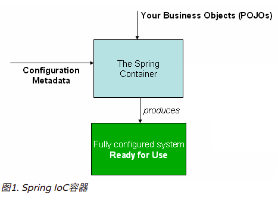

# Spring  核心技术

本章主要讲述spring框架必不可少的技术。其中最重要的是spring框架的控制反转（IoC）和面向方面编程（AOP）。

## 1.IoC

- IoC 也称作依赖注入（DI）。
- 使用构造函数、工厂方法的参数、或在对象实例上设置属性来定义其依赖的过程

`org.springframework.beans` 和 `org.springframework.context` 是IoC容器的基础。 
`BeanFactory` 接口提供了一种可以管理任何类型对象的配置机制。
`ApplicationContext`是它的子类，提供了额外的功能：

- 更容易于AOP集成
- 消息资源处理（国际化）
- 事件发布
- 应用层特定的上下文（如 WebApplicationContext）

## 2.容器

`org.springframework.context.ApplicationContext` 接口代表了IoC容器，它负责实例化，配置和装配Bean。
容器根据读取配置元数据（如xml配置文件）获取需要实例化哪些对象，并根据配置进行配置和注入依赖。


下图说明了配置元数据、容器和业务对象之间的关系。容器通过读取配置文件元数据将业务对象加载到容器中后，系统就可以直接使用这些业务对象了。



### 2.1元数据的配置

spring的配置可以采用多种方式，而XML文件是最为传统的配置方式。Spring还可以采用：

- 基于注解的方式进行配置：spring 2.5 引入
- 基于Java-code 的方式进行配置：spring 3.0 允许使用基于`@Configuration`、`@Bean`、`@Import`、`@DependsOn`等注解使用java代码进行配置。


基于XML的配置文件格式如下：

```xml
<?xml version="1.0" encoding="UTF-8"?>
<beans xmlns="http://www.springframework.org/schema/beans"
    xmlns:xsi="http://www.w3.org/2001/XMLSchema-instance"
    xsi:schemaLocation="http://www.springframework.org/schema/beans
        http://www.springframework.org/schema/beans/spring-beans.xsd">

    <bean id="..." class="...">   
        <!-- collaborators and configuration for this bean go here -->
    </bean>

    <bean id="..." class="...">
        <!-- collaborators and configuration for this bean go here -->
    </bean>

    <!-- more bean definitions go here -->

</beans>
```

上面的xml中配置了两个Bean，它们包含在<beans> 元素中。 每个bean中都有 一个id和class属性。

```
id：用于表示单个bean定义的字符串
class：定义bean的类型，并使用全限定名称。
```


### 2.2 实例化容器

spring 的容器提供了对应的方法去读取配置文件来实例化一个容器。

```java
ApplicationContext context = new ClassPathXmlApplicationContext("ApplicationContext.xml");
```


#### 2.2.1 实例

新建一个maven项目，如下：


##### PersonController

```java
public class PersonController {

    private PersonService personService;

    public void setPersonService(PersonService personService) {
        this.personService = personService;
    }

    public void getPersion() {
        personService.getPersonById("123123");
    }

}
```

##### PersonService

```java
public interface PersonService {
    void getPersonById(String id);
}
```

##### PersonServiceImpl

```java
public class PersonServiceImpl implements PersonService {

    private PersonDao dao;

    public void setDao(PersonDao dao) {
        this.dao = dao;
    }

    @Override
    public void getPersonById(String id) {
        dao.getPersonById(id);
    }
}
```

##### PersonDao

```java
public interface PersonDao {
    void getPersonById(String id);
}
```

##### PersonDaoImpl

```java
public class PersonDaoImpl implements PersonDao {
    @Override
    public void getPersonById(String id) {
        System.out.println("person dao impl get person by id " + id);
    }
}
```

##### ApplicationContext.xml

```xml
<?xml version="1.0" encoding="UTF-8"?>
<beans xmlns="http://www.springframework.org/schema/beans"
       xmlns:xsi="http://www.w3.org/2001/XMLSchema-instance"
       xsi:schemaLocation="http://www.springframework.org/schema/beans http://www.springframework.org/schema/beans/spring-beans.xsd">
    <bean id="personController" class="com.dreamsrj.controller.PersonController">
        <!--通过setter注入-->
        <property name="personService" ref="personService"/> 
    </bean>

    <bean id="personService" class="com.dreamsrj.service.PersonServiceImpl">
        <!--通过setter注入-->
        <property name="dao" ref="personDao"/>
    </bean>

    <bean id="personDao" class="com.dreamsrj.dao.PersonDaoImpl"/>
</beans>
```


##### Test

```java
@Test
public void test() {
    //通过加载配置文件实例化容器
    ApplicationContext context = new ClassPathXmlApplicationContext("ApplicationContext.xml");
    //获取配置文件中定义的bean
    String[] beanDefinitionNames = context.getBeanDefinitionNames();
    System.out.println(Arrays.toString(beanDefinitionNames));

    //第一次从容器中获取实例
    PersonController personController = context.getBean(PersonController.class);
    personController.getPersion();
    //第二次从容器中获取实例
    PersonController personController2 = context.getBean(PersonController.class);
    personController.getPersion();

    //显示true， 容器中的bean默认为单例。
    System.out.println("get twice person controller is equeal : " + (personController == personController2));
}
```


##### 输出结果

```log
[personController, personService, personDao]
person dao impl get person by id 123123
person dao impl get person by id 123123
get twice person controller is equeal : true
```


根据上面的代码可以明显看出，在代码中没有实际创建对象实例，但是在我们需要使用的时候就已经可以使用了。

这是因为Spring在启动的时候，会根据配置元数据创建对象，并将对象所依赖的对象也创建好，并装配好。

==Note==

> 下面的配置，使用了setter进行注入，也就是说`PersonServiceImpl`中的`setPersonDao（...）`方法必须存在，否则无法装配。

```xml
 <bean id="personService" class="com.dreamsrj.service.PersonServiceImpl">
        <!--通过setter注入-->
        <property name="dao" ref="personDao"/>
    </bean>
```


## 3.Bean

Spring IoC 容器管理一个或多个bean。 这些Bean根据程序提供的配置元数据创建。

在容器中， 这些bean的定义使用`BeanDefinition`的实例对象表示，其中包含以下数据：

- 一个全限定类名：通常定义Bean的实际实现类
- Bean的行为配置元素
- 依赖项：当前bean工作需要使用的其他bean
- 其他需要在创建的bean上进行设置的配置项，例如连接池的大小


### 3.1 bean的属性

- Class  定义bean的实现类型
- Name 定义bean的名称，容器中唯一
- Scope bean的实例化范围，例如 单例
- Contructor arguments 构造器参数
- Properties 实现类的属性
- Autowiring mode 装配模式
- Lazy initialization mode 懒加载模式
- Initialization method 初始化方法
- Destruction method 销毁方法


### 3.2 给 Bean 命名

通常使用 `id`或`name`来定义bean的标识符，这些标识符在承载Bean的容器内必须是唯一的。 但是同一个bean可以定义多个名称，如果需要的话。其他定义的名字被当做别名使用。

如下：id 中包含了两个名称

```xml
<bean id="lisi，jack" class="com.dreamsrj.Person"/>
```

同时，spring允许使用标签为其他地方定义的Bean定义一个别名：

```xml
<alias name="fromName" alias="toName"/>
```


### 3.3 Bean的实例化

一个Bean的定义，实际就是描述如何创建这个bean所表示的类的实例。当访问这个Bean或使用这个Bean的时候，容器会检查Bean的定义，去创建或获取一个实例对象。


在xml中，通过`<bean>`标签的`class`属性来指定需要实例化的类型，通常该属性是强制必须指定的。


该属性的两种使用方法

- 通常情况下，指定class属性会通过反射的方式创建bean的实例，这有点像直接通过 `new` 操作符进行创建。
- 调用class属性指定类型的 `static`方法创建对象，这种情况下，容器会调用该类型的静态工厂方法创建对象，而该工厂方法返回的对象的类型可以是一样的，也可以是完全不同的。

> 内部类
>
> 如果想要定义一个静态内部类的Bean，必须使用嵌套类的下二进制名称。
>
> 例如：`com.example.SomeThing` 中定义了一个静态嵌套类`OtherThing`，那么定义该嵌套类的Bean时，class属性需要如下配置：`com.example.SomeThing$OtherThing`。 
>
> ==note== 这里使用 $ 分割了两个类的名称


##### 通过构造函数实例化Bean

Spring IoC容器可以管理任何类型的bean。 但是取决于你使用的IoC的特定的类型，你的bean需要有一个默认的构造器（空构造器）。

如下配置方式，Spring会自动调用类的默认构造器。

```xml
<bean id="exampleBean" class="examples.ExampleBean"/>
```


##### 静态工厂方法实例化Bean

在使用静态工厂方法创建对象的时候，在class属性中指定的是还有静态工厂方法的类型，然后使用`factory-method`属性指定工厂方法的名称。

```xml
<bean id="staitcFactoryMethod" class="com.dreamsrj.factory.ObjectFactory"  
      factory-method="createInstance"/>
```


##### 实例工厂方法实例化bean

```xml
<bean id="serviceLocator" class="examples.DefaultServiceLocator">
    <!-- inject any dependencies required by this locator bean -->
</bean>

<bean id="clientService"
    factory-bean="serviceLocator" 
    factory-method="createClientServiceInstance"/>

<bean id="accountService"
    factory-bean="serviceLocator"
    factory-method="createAccountServiceInstance"/>
```


## 4.依赖关系

依赖注入是一个过程，通过该过程，对象仅通过构造函数，工厂方法的参数或在构造对象实例后，在对象实例上设置属性来定义起依赖关系。然后容器在创建bean时注入这些依赖，


依赖注入的优势：

- 代码更加简洁

- 低耦合

- 更加易于测试， 允许使用模拟实现

  测试类==

  ```java
  package com.dreamsrj.di;
  
  public class User {
      private String name;
      private int age;
      private Address address;
  
      public User() {    }
  
      public User(String name, int age, Address address) {
          this.name = name;
          this.age = age;
          this.address = address;
      }
  	//setter
      ......
  }
  class Address {
      private String address;
  
      public String getAddress() {
          return address;
      }
      //setter
      ......
  }
  
  ```

  

###　4.1 基于构造函数注入

基于构造函数的Di是通过容器调用具有多个参数的构造函数来实现，每个参数代表一个依赖。

这于调用静态的带有特定参数的工厂方法来构造bean几乎是一样的。

====基于构造器参数名称进行注入==

```xml
<bean name="address" class="com.dreamsrj.di.Address">
    <property name="address" value="四川省成都市天赋新区"/>
</bean>

<!--constructor with arg-name -->
<bean name="userOne" class="com.dreamsrj.di.User">
    <constructor-arg name="name" value="dreamsrj"/>
    <constructor-arg name="age" value="28"/>
    <constructor-arg name="address" ref="address"/>
</bean>
```

==基于构造其参数下标==

```xml
<bean name="address" class="com.dreamsrj.di.Address">
    <property name="address" value="四川省成都市天赋新区"/>
</bean>

<bean name="userTwo" class="com.dreamsrj.di.User">
    <constructor-arg index="0" value="dreamsrj"/>
    <constructor-arg index="1" value="29"/>
    <constructor-arg index="2" ref="address"/>
</bean>
```

如果构造器参数类型存在歧义时，可以使用多种手段帮助spring确定参数类型。

- 使用 `type` 属性

  ```xml
  <bean name="userTwo" class="com.dreamsrj.di.User">
      <constructor-arg type="java.lang.String" value="dreamsrj"/>
      <constructor-arg type="int" value="29"/>
      <constructor-arg type="com.dreamsrj.di.Address" ref="address"/>
  </bean>
  ```

- 使用 `index` 属性明确指定参数位置

  ```xml
  <bean name="userTwo" class="com.dreamsrj.di.User">
      <constructor-arg index="0" value="dreamsrj"/>
      <constructor-arg index="1" value="29"/>
      <constructor-arg index="2" ref="address"/>
  </bean>
  ```

- 使用 `name` 属性明确注入参数到哪个参数

  ```xml
  <bean name="userOne" class="com.dreamsrj.di.User">
      <constructor-arg name="name" value="dreamsrj"/>
      <constructor-arg name="age" value="28"/>
      <constructor-arg name="address" ref="address"/>
  </bean>
  ```

  ==注意==

  使用参数名称的方式，必须在 Debug 模式下编译代码，spring才可以根据参数名称进行查找。如果不使用Debug模式进行编译，那么必须使用`@ConstructorProperties`注解显示指定参数名称

  ```xml
  @ConstructorProperties({"name","age","address"})
      public User(String name, int age, Address address) {
          this.name = name;
          this.age = age;
          this.address = address;
      }
  ```

  

### 4.2 基于setter注入

setter注入器是在容器调用无参构造器或无参数静态工厂方法实例化Bean之后，调用实例对象的set方法进行注入，因此需要注入的属性，必须存在对应的set方法，否则无法注入。

```xml
<!--setter-->
<bean class="com.dreamsrj.di.User">
    <property name="address" ref="address"/>
    <property name="age" value="23"/>
    <property name="name" value="dreamsrj"/>
</bean>
```


基于构造器注入和setter注入可以混合使用，一个好的做法是使用构造器注入必须的属性，使用setter注入可选的属性。 同样，基于setter的注入也可以使用`@Required`注解声明属性是必须的。


### 4.3 依赖解析过程

- 使用描述所有bean的元数据创建和初始化`ApplicationContext`容器，配置元数据可以是xml、注解、java code.
- 没一个bean的依赖都使用属性、构造参数、静态方法参数表示.当bean被实际创建的时候，才提供这些依赖.
- 没一个属性、构造参数都是一个实际定义的值，或是引用其他的bean
- 没一个属性或构造参数的值都会从指定的格式转换为它实际的类型。spring默认支持将字符串格式值转换为内置类型的之，例如：int long String 等等。

spring 容器会验证容器中没一个bean配置，但是只会在实际创建的时候才会注入bean需要的属性。默认情况下spring会在容器创建后立即创建singleton-scope 和 pre-instantiated的bean（默认的）。在创建bean的时候会创建一个bean图，他会创建这个bean所依赖的所有的bean，以及依赖的依赖。


==注意== 

注入类型的不匹配可能会发现的较晚，即在第一次创建时发现。 单例默认在容器初始化时创建。


==循环依赖==

在使用构造器注入时，可能造成循环依赖，例如A依赖B，B也依赖A，如果他们都使用构造器注入彼此，此时spring在运行是会抛出`BeanCurrentlyInCreateionException`异常。 一个解决方法是使用setter注入替代，虽然不推荐循环依赖。 先有鸡还是先有蛋？


# Spring 如何创建对象

spring 默认使用无参构造器创建对象。


## 创建对象的时机

- spring对于singleton类型的bean在初始化容器的时候进行创建，并创建其依赖的bean。
- spring对于prototype类的的bean在使用的时候创建，并且每次使用都创建一个全新的bena。
- 


